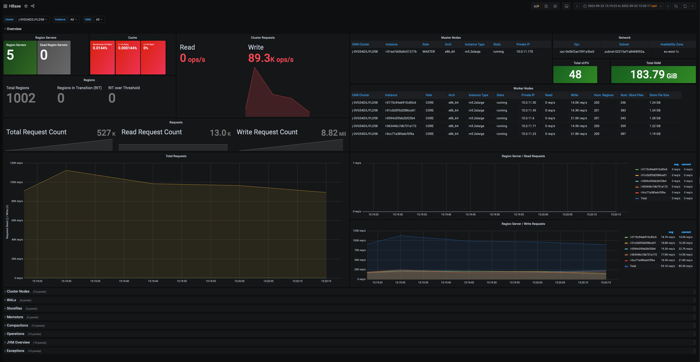

# aws-emr-hbase-monitoring

This template allows you to provision an Amazon EMR HBase cluster, to demonstrate how to monitor HBase using Prometheus and Grafana.



## Instructions

### Artifact Bucket
Launch the script [setup-artifact-bucket.sh](setup-artifact-bucket.sh) to copy scripts and resources required by the stack in a private S3 bucket that you own. For example:

```bash
sh setup-artifact-bucket.sh YOUR_BUCKET_NAME
```

The script will copy all the resources in the following S3 path: YOUR_BUCKET_NAME/artifacts/aws-emr-hbase-monitoring

### (Optional) Create an Amazon VPC
Launch the stack [vpc.yaml](templates/vpc.yaml) to provision a new VPC used by the EMR cluster. This step is optional and you can safely avoid it, if you have an existing VPC in your AWS account.

### Amazon EMR cluster
Launch the stack [emr-hbase-cluster.yaml](templates/emr-hbase-cluster.yaml) to provision the EMR cluster. While launching the stack please set the following mandatory parameters:

  - Artifacts: Replace **YOUR_BUCKET_NAME** with the bucket name previously used in the [setup-artifact-bucket.sh](setup-artifact-bucket.sh) script.
  - Fill the required parameters in the EMR section (Vpc, Subnet, SSH Key Name) to match your environment.

At the end of the cluster provisioning, you will be able to reach the HBase dashboard using the grafana endpoint available at the following address: http://**MASTER_IP_ADDRESS**:3000

To login in the Grafana interface, you can use the default admin credentials: **admin**:**admin**

Please note that in order to access the Grafana Web interface, it will be required to set up a [local port forwarding](https://docs.aws.amazon.com/emr/latest/ManagementGuide/emr-ssh-tunnel-local.html) or [dynamic port forwarding](https://docs.aws.amazon.com/emr/latest/ManagementGuide/emr-ssh-tunnel.html). Please refer to the Amazon EMR documentation for additional details.

## Setup Details
This section provides additional information in case you want to perform a manual setup of what performed in the CloudFormation stack.

In order to monitor the HBase cluster using the Grafana Dashboard, you should install the prometheus [node_exporter](https://github.com/prometheus/node_exporter) utility on each node to collect additional details from the nodes (CPU, Memory, Disk, Network metrics) and the [Prometheus JMX exporter](https://github.com/prometheus/jmx_exporter) to prepare HBase JMX metrics for prometheus scraping.

Please refer to the following scripts for additional information on the setup and configurations of the components previously described:

- [emr-ba-prometheus_exporter.sh](resources/emr-ba-prometheus_exporter.sh) Node Exporter and Prometheus JMX exporter setup
- [emr-step-monitoring_apps.sh](resources/emr-step-monitoring_apps.sh) Prometheus & Grafana setup

Finally, in order to expose HBase JMX metrics from the HBase Master and Region Servers is required to set the following variables in the */etc/hbase/conf/hbase-env.sh* script:

```bash
export HBASE_MASTER_OPTS="$HBASE_MASTER_OPTS -javaagent:/opt/prometheus/prometheus_javaagent.jar=7000:/opt/prometheus/hbase.yml"
export HBASE_REGIONSERVER_OPTS="$HBASE_REGIONSERVER_OPTS -javaagent:/opt/prometheus/prometheus_javaagent.jar=7000:/opt/prometheus/hbase.yml"
```

This can easily be achieved using the following [EMR Configurations](https://docs.aws.amazon.com/emr/latest/ReleaseGuide/emr-configure-apps.html)

```json
[
  {
    "classification": "hbase-env",
    "configurations": [
      {
        "classification": "export",
        "properties": {
          "HBASE_REGIONSERVER_OPTS": "\"$HBASE_REGIONSERVER_OPTS -javaagent:/opt/prometheus/prometheus_javaagent.jar=7000:/opt/prometheus/hbase.yml\"",
          "HBASE_MASTER_OPTS": "\"$HBASE_MASTER_OPTS -javaagent:/opt/prometheus/prometheus_javaagent.jar=7000:/opt/prometheus/hbase.yml\""
        }
      }
    ],
    "properties": {}
  }
]
```
