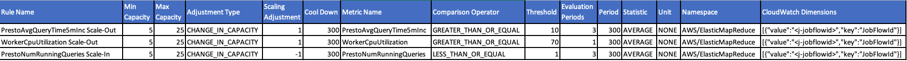

# Trino Autoscaling

## Introduction

This package contains a script that publishes Trino JMX metrics from EMR clusters to CloudWatch. The metrics can be used by EMR automatic scaling policies to enable the cluster to scale up and down. For more details, see "Tip 8: Advanced scaling using automatic scaling based on custom Presto metrics" in [Top 9 performance tuning tips for PrestoDB on Amazon EMR](https://aws.amazon.com/blogs/big-data/top-9-performance-tuning-tips-for-prestodb-on-amazon-emr/).

## Installation

1. Copy `trino_cloudwatch_ba.sh` and `trino_cloudwatch.sh` to S3.

2. Change the bucket name in `trino_cloudwatch_ba.sh` (line 8).

3. Add `trino_cloudwatch_ba.sh` as an EMR bootstrap action (BA) script. This BA script will download `trino_cloudwatch.sh` and run it as a scheduled job (every 30 seconds). The script publishes Trino metrics to CloudWatch.

4. Create EMR cluster with the following Classification: 
```
[{"classification":"trino-connector-jmx", "properties":{"connector.name":"jmx"}, "configurations":[]}]
```

5. Add the following autoscaling rules to the EMR cluster. These are just examples and can be changed based on cluster usage patterns:



## Limitations

1. As of EMR 5.19.0, custom metrics cannot be entered from the EMR Console, so you will need to use the AWS CLI to launch the EMR cluster. Also, you cannot create a new cluster by cloning an existing cluster that uses custom metrics, as doing so will break autoscaling using custom metrics. So for now, always use the AWS CLI to launch a new cluster for autoscaling using custom metrics.

2. Once a cluster is launched, the autoscaling policy cannot be changed or detached and reattached, as doing so will disable the autoscaling. If you need to change the autoscaling policy, you will need to launch a new cluster with the new policy using the AWS CLI.

3. If using Presto, modify `trino_cloudwatch.sh` and replace all `trino` occurences with `presto`.
