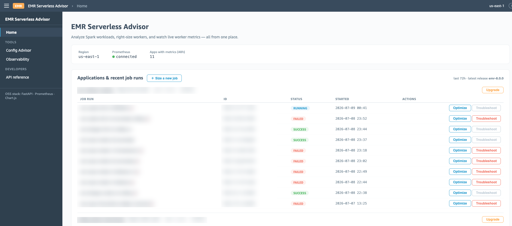
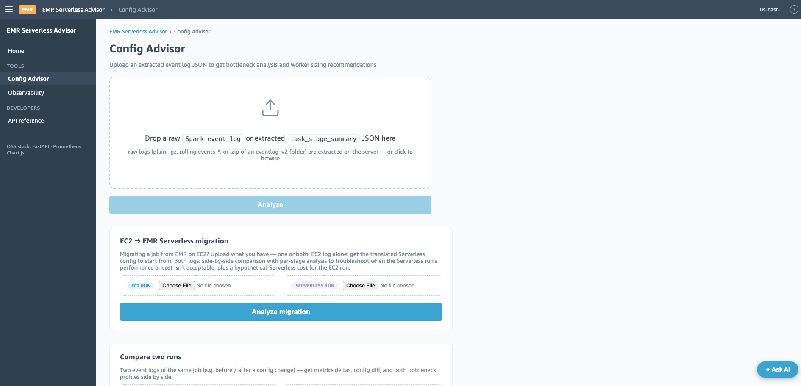
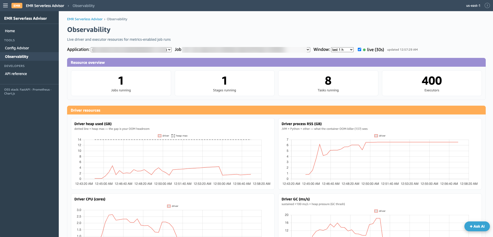
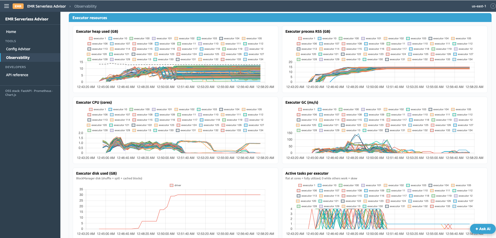
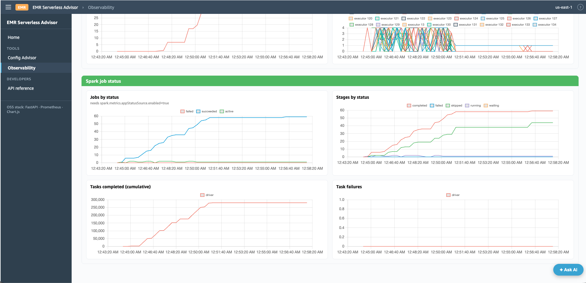

# EMR Serverless Config Advisor

Right-size your Spark jobs on EMR Serverless. Two tools, one goal: optimal configurations without guesswork.

## The Two Tools

| Tool | What It Does | What It Needs |
|------|-------------|---------------|
| **`emr_s_tshirt_size.py`** | Generates safe, ready-to-run Spark configs | Your workload size and type |
| **`emr_s_fine_tuner.py`** | Produces precise cost and performance configs | A Spark event log |

Use the T-shirt sizer when you want configs fast. Use the Fine Tuner when you want configs tuned to your exact workload.

## Web UI

Both tools (and more) are available through a local web UI — see
[WEBUI_README.md](WEBUI_README.md) for setup. It adds:

- **Config Advisor page**: drag-and-drop raw Spark event logs (EMR Serverless
  or EMR on EC2; single files or zipped rolling directories) — extraction
  runs server-side. Results include bottleneck classification, cost/perf
  recommendations, run cost, Spark-UI-style query plans with per-operator
  failure attribution, and a recommended-vs-submitted config audit.
- **EC2 → Serverless migration**: EC2 logs are auto-detected and translated;
  upload an EC2 baseline plus a Serverless attempt for a migration-mode
  comparison.
- **Compare two runs**: metric deltas, config diff, and per-stage CPU-per-GB
  analysis to localize regressions.
- **Observability**: live driver/executor dashboards (heap, RSS, CPU, GC,
  disk, tasks) for metrics-enabled job runs, backed by a self-hosted
  Prometheus.
- **Ask AI** (optional): an embedded assistant that grounds its answers in
  the analyses, the EMR Serverless API, and live metrics.

```bash
pip install fastapi 'uvicorn[standard]' python-multipart jinja2 boto3
python3 app.py    # http://localhost:5000
```

### Screenshots

The home page lists your EMR Serverless applications and their recent job runs, with one-click **Optimize** and **Troubleshoot** actions per run, plus a **Size a new job** button that opens the T-shirt sizer:



The Config Advisor page is the web front end for the Fine Tuner: drag and drop a raw Spark event log (or an extracted summary) for server-side analysis, and use the EC2→Serverless migration and compare-two-runs workflows on the same page:



The Observability page shows live driver and executor dashboards for metrics-enabled job runs, backed by a self-hosted Prometheus. The resource overview tracks running jobs, stages, tasks, and executors; the driver panels chart heap used against heap max (the gap is your out-of-memory headroom), process RSS, CPU, and GC pressure:



Executor panels chart the same resources across every executor in the run, plus disk used by shuffle/spill/cached blocks and active tasks per executor — the active-tasks chart makes skew visible at a glance:



A Spark job status section tracks jobs, stages, and tasks by status over the run, so you can watch completion progress and spot task failures as they happen:



---

## T-Shirt Sizing

Pick a size. Get configs. Run your job.

```bash
python3 emr_s_tshirt_size.py --size M
```

That is the entire interface. One command, one decision.

Need spark-submit parameters you can paste directly into a `StartJobRun` call?

```bash
python3 emr_s_tshirt_size.py --size L --format spark-submit
```

Know your workload pattern? Add a sub-category:

```bash
python3 emr_s_tshirt_size.py --size L --sub-category Optimized
```

### Sizing Explode / Fan-Out Jobs

If your job has small input but produces massive intermediate data (EXPLODE, CROSS JOIN, array expansion), provide the shuffle volume or fan-out factor so the tool can size correctly:

```bash
# You know the shuffle volume (check Spark UI from a prior run):
python3 emr_s_tshirt_size.py --size S --input-size-gb 3 --shuffle-write-gb 4000

# You know the amplification factor (e.g. EXPLODE on 500-element arrays):
python3 emr_s_tshirt_size.py --size S --input-size-gb 3 --fan-out-factor 500
```

The tool auto-bumps the size and sub-category when shuffle signals indicate a heavier workload than the input size alone suggests.

### Migrating from EC2? Provide Your Current Runtime

If you know how long the job currently takes (from YARN UI, EMR Step history, or the EMR Serverless console), pass it in minutes. The tool will right-size executor count to match that runtime — no over-provisioning:

```bash
# Job currently takes 45 minutes on EC2:
python3 emr_s_tshirt_size.py --size L --target-duration-minutes 45

# Job takes 2 hours, with 5TB shuffle:
python3 emr_s_tshirt_size.py --size XL --target-duration-minutes 120 --shuffle-write-gb 5000
```

Without `--target-duration-minutes`, the tool uses generous defaults. With it, executor count is right-sized to match your target runtime.

### For Optimized Runs: Use the Fine Tuner

The T-shirt sizer is a starting point. After your first successful run, pass the event log to the Fine Tuner for precise, measured configs:

```bash
# First run — use T-shirt sizing:
python3 emr_s_tshirt_size.py --size L --sub-category Optimized --format spark-submit

# After the run completes, extract the event log and get precise configs:
python3 python_extractor.py --input s3://your-bucket/event-logs/app_id/ --output /tmp/extracted/
python3 emr_s_fine_tuner.py --input-path /tmp/extracted/
```

The Fine Tuner analyzes actual task metrics, shuffle volumes, spill, and memory utilization to produce configs that are typically 25–35% cheaper than the T-shirt sizer's configuration on the same workload — and substantially cheaper than untuned platform defaults (−61% on our full TPC-DS 3 TB evaluation) — while maintaining the same or better performance.

### Choosing Your Size

| Size | Input Data | Typical Duration |
|------|-----------|-----------------|
| **XS** | Under 5 GB | Under 5 minutes |
| **S** | 5 to 100 GB | 5 to 30 minutes |
| **M** | 100 GB to 1 TB | 15 to 60 minutes |
| **L** | 1 to 5 TB | 20 minutes to 2 hours |
| **XL** | Over 5 TB | 1 to 4 hours |

### Choosing a Sub-Category

Default is **General** — safe for any workload. Pick a specialized category only if your workload clearly matches:

| Sub-Category | The Pattern | Difference from General |
|---|---|---|
| **General** | Mixed workload, or you are not sure. Start here. | 1-wave partitions, 200G disk |
| **Optimized** | Heavy GROUP BY, multi-table JOINs, shuffle >1 TB or >30% of input, 20+ joins. | 2-wave partitions, shuffle-scaled disk (200G–2000G) |
| **IO-Optimized** | Tiny input that explodes into massive intermediate data (EXPLODE, CROSS JOIN). | Optimized + smaller workers × 2 executors for disk parallelism |
| **Iceberg-Maintenance** | File compaction, snapshot expiration, manifest rewrites. No business logic. | Fixed 4c/14G workers, scaled by file count |

For **Iceberg-Maintenance**, if you know the number of files to compact, just provide that — sizing is handled automatically:

```bash
python3 emr_s_tshirt_size.py --sub-category Iceberg-Maintenance --num-files 3000
```

Or pick a size manually based on file count:

| Files to Compact | Recommended Size |
|-----------------|-----------------|
| Under 500 | S |
| 500 to 5,000 | M |
| 5,000 to 20,000 | L |
| Over 20,000 | XL |

---

## Fine Tuner

When you have a Spark event log — from any prior run on EMR Serverless or EMR on EC2 — the Fine Tuner analyzes 80+ metrics and produces precisely sized configurations.

```bash
python3 emr_s_fine_tuner.py --input-path s3://your-bucket/event-logs/application_id/
```

It generates two outputs:
- **Cost-optimized** — minimum resources to complete reliably
- **Performance-optimized** — additional headroom for latency-sensitive workloads

### What It Analyzes

The Fine Tuner extracts task counts, stage-level shuffle and spill volumes, executor memory and CPU utilization, I/O timing breakdowns, and driver statistics. From these, it determines:

- Worker type (Small 4-core, Medium 8-core, or Large 16-core)
- Executor count and memory
- Shuffle partitions and advisory partition size
- Disk type and capacity
- Network and shuffle timeouts
- Broadcast join thresholds

### Running the Full Pipeline

Extract metrics, generate recommendations, and format for deployment in one command:

```bash
python3 pipeline_wrapper.py \
  --input s3://your-bucket/event-logs/ \
  --output /tmp/advisor-output/ \
  --format-job-config
```

Or step by step:

```bash
# Extract
python3 python_extractor.py --input s3://your-bucket/event-logs/ --output /tmp/extracted/

# Recommend
python3 emr_s_fine_tuner.py --input-path /tmp/extracted/

# Format for deployment
python3 format_to_job_config.py --input recommendations_cost_optimized.json --output job_config.json
```

---

## How They Work Together

The T-shirt sizer and Fine Tuner are complementary. Neither requires the other.

```
No event log available          Event log available
        │                              │
        ▼                              ▼
┌─────────────────┐          ┌──────────────────┐
│ emr_s_tshirt    │          │ emr_s_fine_tuner │
│ _size.py        │          │ .py              │
│                 │          │                  │
│ Input: size +   │          │ Input: event log │
│ sub-category    │          │ S3 path          │
│                 │          │                  │
│ Output: safe    │          │ Output: precise  │
│ configs         │          │ configs          │
└─────────────────┘          └──────────────────┘
```

A common pattern: use the T-shirt sizer for the initial run, then feed the resulting event log into the Fine Tuner for subsequent runs. But either tool stands alone.

---

## Design Principles

**Stability over speed.** The T-shirt sizer prioritizes job completion — configs are intentionally generous. The Fine Tuner balances precision with safety, using measured metrics to right-size without over-provisioning.

**AQE handles the rest.** Shuffle partitions are set using a wave-based formula: `waves × executor-estimate × cores` (min 1000, max 10000), where the executor estimate is derived from input size, target duration, and shuffle volume. General uses 1 wave; Optimized and IO-Optimized use 2 waves. Adaptive Query Execution coalesces unused partitions at runtime.

**Dynamic allocation scales down.** EMR Serverless releases idle executors automatically. Instead of a static `maxExecutors` ceiling (which forces you to guess an absolute number at cold start), the T-shirt sizer uses dynamic allocation *rate controls* — `executorAllocationRatio=0.5` and `sustainedSchedulerBacklogTimeout=15s`. These throttle how fast the job requests new executors without capping the maximum, so a job that genuinely needs more executors still gets them, but short stages don't over-provision. On TPC-DS at 3 TB this cut cost ~42% versus platform defaults and reduced run-to-run cost variance (median CV 27% → 21%). (XS micro-jobs and Iceberg-Maintenance keep an explicit `maxExecutors`, since their sizing is bounded by design.)

### Config Matrix

Worker type (cores/memory) is fixed by size + sub-category. `partitions` and `disk` are dynamically computed for Optimized/IO-Optimized. General, Optimized, and IO-Optimized use dynamic allocation rate controls (`executorAllocationRatio=0.5`, `sustainedSchedulerBacklogTimeout=15s`) instead of a static `maxExecutors`; XS and Iceberg-Maintenance keep an explicit `maxExecutors` because their sizing is bounded by design.

| Size | Sub-category | Cores | Memory | Executor scaling | Partitions | Disk |
|------|-------------|-------|--------|------------------|-----------|------|
| XS | General | 1 | 2G | maxExec=3 | 20 | — |
| S | General | 4 | 27G | DRA rate controls | 1000 | 200G |
| S | Optimized | 4 | 27G | DRA rate controls | 2 × f(input) × cores | f(shuffle) |
| S | IO-Optimized | 4 | 27G | DRA rate controls | 2 × f(input) × cores | f(shuffle) |
| M | General | 8 | 54G | DRA rate controls | 1000 | 200G |
| M | Optimized | 8 | 54G | DRA rate controls | 2 × f(input) × cores | f(shuffle) |
| M | IO-Optimized | 4 | 27G | DRA rate controls | 2 × f(input) × cores | f(shuffle) |
| L | General | 8 | 54G | DRA rate controls | 1000 | 200G |
| L | Optimized | 8 | 54G | DRA rate controls | 2 × f(input) × cores | f(shuffle) |
| L | IO-Optimized | 4 | 27G | DRA rate controls | 2 × f(input) × cores | f(shuffle) |
| XL | General | 16 | 108G | DRA rate controls | 2000 | 200G |
| XL | Optimized | 16 | 108G | DRA rate controls | 2 × f(input) × cores | f(shuffle) |
| XL | IO-Optimized | 8 | 54G | DRA rate controls | 2 × f(input) × cores | f(shuffle) |

- `f(input)` — internal executor estimate derived from target duration, shuffle volume, and throughput constraints; used to size partitions and disk (partitions min 1000, max 10000)
- `f(shuffle)` — disk per executor: `shuffle_gb / f(input) × 1.5` (min 200G, max 2000G)

---

## Benchmark Results

Evaluated on the full TPC-DS suite at 3 TB scale, 95 queries, three iterations per configuration, EMR Serverless release emr-7.13.0. Each query ran as its own job; cost is computed from `billedResourceUtilization` at list rates.

The workflow delivers escalating savings as you give the tools more information:

| Configuration | Input needed | Runtime | Cost | Cost vs defaults | Regressions |
|--------------|-------------|---------|------|-----------------:|:-----------:|
| Platform defaults | Nothing | 775 min | $38.65 | — | — |
| T-shirt General (`--size L`) | Data size | 393 min | $22.58 | −42% | 9/95 |
| T-shirt Optimized (`--shuffle-write-gb`) | + Shuffle volume | 356 min | $20.18 | −48% | 9/95 |
| Fine Tuner (cost-optimized) | One event log | 318 min | $14.89 | −61% | 0/95 |

The Fine Tuner produced zero cost regressions across all 95 queries. Cost variance (run-to-run predictability) also improves at each step: median coefficient of variation falls from 27% (defaults) → 21% (General) → 7% (Optimized) → 6% (Fine Tuner).

A separate performance-optimized run of the full suite achieved −72.7% runtime / −18.3% cost with zero regressions — the right profile for latency-sensitive jobs.

---

## Scripts Reference

| Script | Purpose |
|--------|---------|
| `emr_s_tshirt_size.py` | T-shirt sizing — quick configs from size + sub-category |
| `emr_s_fine_tuner.py` | Fine tuning — precise configs from event log analysis |
| `python_extractor.py` | Extract metrics from event logs (pure Python, runs anywhere) |
| `spark_extractor.py` | Extract metrics from event logs (PySpark, runs on EMR) |
| `pipeline_wrapper.py` | End-to-end: extract, recommend, format |
| `format_to_job_config.py` | Convert recommendations to `sparkSubmitParameters` |
| `lambda_orchestrator.py` | Lambda function for parallel extraction at scale |
| `write_to_iceberg.py` | Persist recommendations to Iceberg table |

---

## Prerequisites

- Python 3.7 or later
- `pip install boto3 zstandard pandas`
- For Spark-based extraction: an EMR cluster or EMR Serverless application
- For Iceberg writes: Glue Catalog access and Iceberg Spark runtime JAR

## License

MIT-0. See LICENSE.
