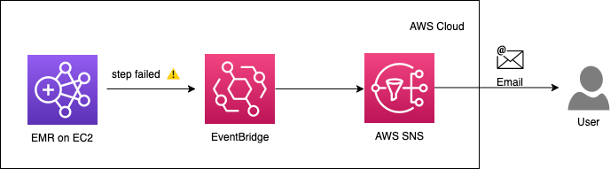
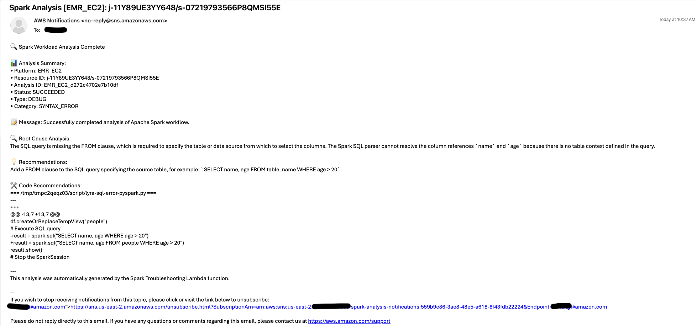
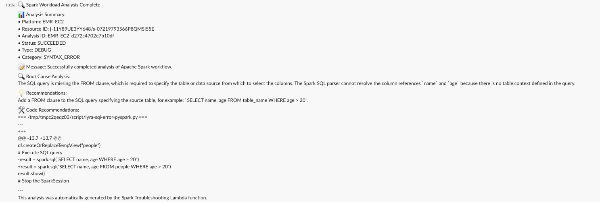

# Integrate Apache Spark Troubleshooting Agent into EMR/EMRS/Glue Monitoring and Notification Workflow

## Context

Many customers use EventBridge to listen to EMR Step/EMR Serverless Job/Glue Job status update; and when the status is changed to FAILED, it sends a notification to AWS SNS topic, which has targets in customer’s monitoring and notification system, for example, email notification or Slack notification.

Existing workflow:



The content of the notification in this flow only has basic information of the EMR Step id, cluster id/EMR Serverless App id, job id/Glue jobrun id. Customers need additional efforts, for example, query the logs on AWS Console or using AWS CLI, to understand what went wrong.

In this blog, we introduce a solution which integrates the capabilities of[Apache Spark Troubleshooting Agent](https://docs.aws.amazon.com/emr/latest/ReleaseGuide/spark-troubleshoot.html)into the monitoring and notification workflow, that can help to automate the troubleshooting process, enrich the notification content with detailed root cause analysis and code fix recommendations.


## Solution Overview


The integration with Apache Spark Troubleshooting Agent will be via a Lambda function, which interacts with the MCP tools being hosted on SageMaker Unified Studio MCP server using Strands MCP Client. This Lambda function is triggered by Eventbridge when EMR-EC2 step fails, EMR Serverless job fails, or Glue Jobrun fails, it uses the Apache Spark Troubleshooting Agent to analyze the failures, find the root cause and generate code fix recommendations. Then, it constructs a comprehensive analysis summary, sends the summary to SNS, and SNS delivers the content to the configured destination, such as Email and Slack.


## Prerequisites

* [Install Python 3.13+](https://www.python.org/downloads/release/python-3130/)
* Install AWS CLI
* AWS credentials configured (via [AWS CLI](https://docs.aws.amazon.com/cli/latest/userguide/cli-chap-configure.html), environment variables, or IAM roles)
* (Optional) Slack channel workflow webhood setup.

## Steps - Configuring via AWS CloudFormation Stack Template (Recommended)

You can find the `spark-analysis-stack.yaml` CloudFormation template in the same directory of the Github repository, and create the resources of this notification flow with it. You can either deploy it with the [CloudFormation CLI](https://docs.aws.amazon.com/cli/latest/reference/cloudformation/), or using the CloudFormation console. 

Before deploying the CloudFormation Stack, you will need to build the Lambda Deployment package and upload it to your S3 bucket:

#### Build the Lambda Deployment Package

The [Lambda function](../spark-troubleshooting-agent-notification-integration/event-bridge-integration/lambda-function.py) code is being provided in this GitHub repository, you can build it by running the [build_lambda_package.sh](../spark-troubleshooting-agent-notification-integration/event-bridge-integration/build_lambda_package.sh) script. This script creates a ZIP file with all dependencies needed for the Lambda deployment package.


#### Upload the Lambda Deployment Package to your S3 bucket

```
# Replace YOUR_BUCKET with your S3 bucket name
aws s3 cp spark-analysis-lambda.zip \
    s3://YOUR_BUCKET/lambda-packages/spark-analysis-lambda.zip
```

And use the S3 bucket name and the object key in the CloudFormation template arguments.

If you configure email subscription as the target of the SNS topic, you will receive an email from  `AWS Notifications <no-reply@sns.amazonaws.com>` regarding how to confirm the subscription; if you configure Slack channel webhook as the target of the SNS topic, please check this doc https://docs.aws.amazon.com/prometheus/latest/userguide/AMP-alertmanager-SNS-otherdestinations.html#AMP-alertmanager-SNS-otherdestinations-Slack which links to an instruction video: https://www.youtube.com/watch?v=CszzQcPAqNM regarding the webhook setup, and subcription confirmation.

## Steps - Configuring via CLI

Alternatively, you can follow the steps of AWS CLIs to set up each component separately. The CLI instruction would be helpful, if you already have some components of the notification flow, such as eventbridge rule, SNS topic, in your AWS account. See [CLI Instructions](./spark-troubleshooting-agent-eventbridge-integration-cli.md)


## Test with an Example

The Spark Application script:

```
from pyspark.sql import SparkSession

# Create Spark session
spark = SparkSession.builder \
    .appName("MySparkJob") \
    .getOrCreate()

# Create a simple DataFrame
data = [("Alice", 25), ("Bob", 30)]
df = spark.createDataFrame(data, ["name", "age"])

# Create temporary view
df.createOrReplaceTempView("people")

# Execute SQL query
result = spark.sql("SELECT name, age WHERE age > 20")
result.show()

# Stop the SparkSession
spark.stop()
```

Ran it with EMR-EC2, and the step failed. With the new notification workflow, we received the email



And the Slack Message:



## Cost Estimation

You can get these insights with automated Spark Application troubleshooting at a minimal cost. Suppose in the us-east-1 region, there're 3000 Spark application (from EMR EC2, EMR Serverless, or Glue) failures in total, the monthly cost would be less than $0.1. Most of the cost comes from the Lambda function execution and its logs. The EventBridge rule is free for [AWS Events](https://aws.amazon.com/eventbridge/pricing/).


