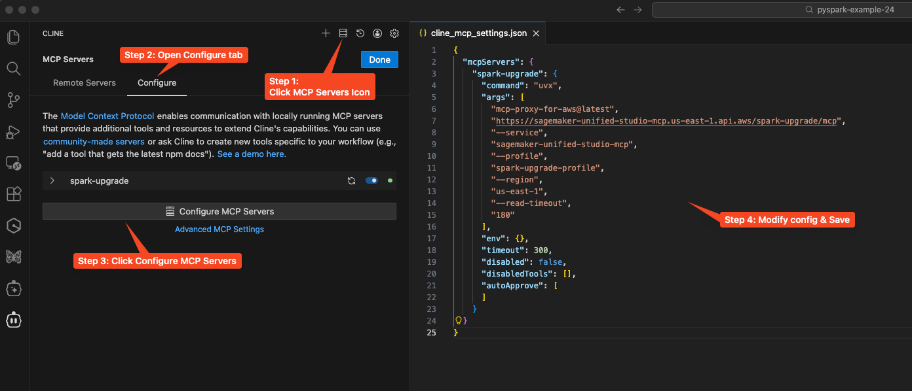

# Apache Spark Troubleshooting Agent for Amazon EMR

## Overview

The Apache Spark Troubleshooting Agent for Amazon EMR provides AI-powered troubleshooting capabilities for Apache Spark applications running on AWS Glue, EMR-EC2, and EMR-Serverless. It helps diagnose issues, analyze logs, and provide recommendations for resolving Spark job failures.

For further reference on architecture and detailed information, check https://docs.aws.amazon.com/emr/latest/ReleaseGuide/spark-troubleshoot.html

## Setup Instructions

### Prerequisites

Before we begin our setup process, make sure you have the following installed on your workstation: 

- AWS CLI - https://docs.aws.amazon.com/cli/latest/userguide/getting-started-install.html
- Python 3.10 or above - https://www.python.org/downloads/
- Uv - https://docs.astral.sh/uv/getting-started/installation/
- Kiro CLI - https://kiro.dev/docs/cli/installation/
- AWS local credentials configured (via AWS CLI, environment variables, or IAM roles) - for local operations such as accessing logs and troubleshooting Spark applications

### Step 1: Deploy CloudFormation Stack

**Basic deployment (all services enabled):**

```bash
aws cloudformation deploy \
  --template-file spark-troubleshooting-mcp-setup.yaml \
  --stack-name spark-troubleshooting-mcp-setup \
  --capabilities CAPABILITY_NAMED_IAM
```

**With custom parameters:**

```bash
aws cloudformation deploy \
  --template-file spark-troubleshooting-mcp-setup.yaml \
  --stack-name spark-troubleshooting-mcp-setup \
  --capabilities CAPABILITY_NAMED_IAM \
  --parameter-overrides \
    TroubleshootingRoleName=spark-troubleshooting-role \
    EnableEMREC2=true \
    EnableEMRServerless=true \
    EnableGlue=false
```

**Enable specific services only:**

```bash
# EMR-EC2 and Glue only
aws cloudformation deploy \
  --template-file spark-troubleshooting-mcp-setup.yaml \
  --stack-name spark-troubleshooting-mcp-setup \
  --capabilities CAPABILITY_NAMED_IAM \
  --parameter-overrides \
    EnableEMREC2=true \
    EnableEMRServerless=false \
    EnableGlue=true
```

**With CloudWatch KMS encryption:**

If your CloudWatch Logs are encrypted with a KMS key:

```bash
aws cloudformation deploy \
  --template-file spark-troubleshooting-mcp-setup.yaml \
  --stack-name spark-troubleshooting-mcp-setup \
  --capabilities CAPABILITY_NAMED_IAM \
  --parameter-overrides \
    CloudWatchKmsKeyArn=arn:aws:kms:us-east-1:111122223333:key/a1b2c3d4-5678-90ab-cdef-EXAMPLE11111
```

**With EMR-Serverless S3 logging:**

If your EMR-Serverless application stores logs in S3 instead of (or in addition to) CloudWatch Logs:

```bash
aws cloudformation deploy \
  --template-file spark-troubleshooting-mcp-setup.yaml \
  --stack-name spark-troubleshooting-mcp-setup \
  --capabilities CAPABILITY_NAMED_IAM \
  --parameter-overrides \
    EnableEMRServerless=true \
    EMRServerlessS3LogPath=s3://my-logs-bucket/emr-serverless-logs
```

**Note:** This parameter is only used when `EnableEMRServerless=true`. It grants the troubleshooting role read-only access to your EMR-Serverless S3 logs for analysis.

**Parameter options:**
- `TroubleshootingRoleName` - Name of the IAM role to create for troubleshooting operations (leave empty to auto-generate with stack name for uniqueness, allowing multiple stack deployments)
- `EnableEMREC2` - Enable EMR-EC2 troubleshooting permissions (default: true)
- `EnableEMRServerless` - Enable EMR-Serverless troubleshooting permissions (default: true)
- `EnableGlue` - Enable Glue troubleshooting permissions (default: true)
- `CloudWatchKmsKeyArn` - (Optional) ARN of existing KMS key for CloudWatch Logs encryption (leave empty for default encryption)
- `EMRServerlessS3LogPath` - (Optional) S3 path where EMR-Serverless application logs are stored. Only used when `EnableEMRServerless=true`. Supports formats: `s3://bucket/path` or `bucket/path`

**Note:** By default, the IAM role name is auto-generated using the stack name, which allows you to deploy multiple instances of this stack in the same account and region without conflicts.

After deployment completes, copy and run the export command from the CloudFormation output to set your environment variables.

For Example:

```bash
export SMUS_MCP_REGION=us-east-1 && export IAM_ROLE=arn:aws:iam::111122223333:role/spark-troubleshooting-role-xxxxxx
```

### Step 2: Configure AWS CLI Profile

```bash
aws configure set profile.smus-mcp-profile.role_arn ${IAM_ROLE}
aws configure set profile.smus-mcp-profile.region ${SMUS_MCP_REGION}
aws configure set profile.smus-mcp-profile.source_profile <AWS CLI Profile to assume the IAM role - ex: default>
```

### Step 3: Configure MCP Servers

#### Kiro CLI (Recommended)
If you are using Kiro CLI, use the following command to add the MCP configurations:

**Spark Troubleshooting & Code Recommendation MCP Servers:**

```bash
kiro-cli-chat mcp add \
    --name "sagemaker-unified-studio-mcp-troubleshooting" \
    --command "uvx" \
    --args "[\"mcp-proxy-for-aws@latest\",\"https://sagemaker-unified-studio-mcp.${SMUS_MCP_REGION}.api.aws/spark-troubleshooting/mcp\", \"--service\", \"sagemaker-unified-studio-mcp\", \"--profile\", \"smus-mcp-profile\", \"--region\", \"${SMUS_MCP_REGION}\", \"--read-timeout\", \"180\"]" \
    --timeout 180000 \
    --scope global

kiro-cli-chat mcp add \
    --name "sagemaker-unified-studio-mcp-code-rec" \
    --command "uvx" \
    --args "[\"mcp-proxy-for-aws@latest\",\"https://sagemaker-unified-studio-mcp.${SMUS_MCP_REGION}.api.aws/spark-code-recommendation/mcp\", \"--service\", \"sagemaker-unified-studio-mcp\", \"--profile\", \"smus-mcp-profile\", \"--region\", \"${SMUS_MCP_REGION}\", \"--read-timeout\", \"180\"]" \
    --timeout 180000 \
    --scope global
```

#### Manual Configuration
Alternatively, you can manually configure the MCP servers with your preferred GenAI conversational assistant/IDE. For Kiro CLI, the MCP configuration is located in `~/.kiro/settings/mcp.json`. If you are using some other conversational assistant, consult their documentation for specific path.

The configuration requires us to provide region information. For **US East (N. Virginia) - `us-east-1`**, the configuration will be: 

**Spark Troubleshooting & Code Recommendation MCP Servers:**

```json
{
  "mcpServers": {
    "sagemaker-unified-studio-mcp-troubleshooting": {
      "type": "stdio",
      "command": "uvx",
      "args": [
        "mcp-proxy-for-aws@latest",
        "https://sagemaker-unified-studio-mcp.us-east-1.api.aws/spark-troubleshooting/mcp",
        "--service",
        "sagemaker-unified-studio-mcp",
        "--profile",
        "smus-mcp-profile",
        "--region",
        "us-east-1",
        "--read-timeout",
        "180"
      ],
      "timeout": 180000,
      "disabled": false
    },
    "sagemaker-unified-studio-mcp-code-rec": {
      "type": "stdio",
      "command": "uvx",
      "args": [
        "mcp-proxy-for-aws@latest",
        "https://sagemaker-unified-studio-mcp.us-east-1.api.aws/spark-code-recommendation/mcp",
        "--service",
        "sagemaker-unified-studio-mcp",
        "--profile",
        "smus-mcp-profile",
        "--region",
        "us-east-1",
        "--read-timeout",
        "180"
      ],
      "timeout": 180000,
      "disabled": false
    }
  }
}
```

Update the region name in SigV4 Endpoint and the `--region` parameter if you wish to use a region other than `us-east-1`.

#### Other IDEs and Tools

**Amazon Q Developer CLI (Legacy)**
If you are using Amazon Q Developer CLI and have not migrated to Kiro CLI, we strongly recommend you to upgrade. That said, you can still use the MCP server with Q CLI. To configure the MCP server, use the following shell command:

```bash
qchat mcp add \
    --name "sagemaker-unified-studio-mcp-troubleshooting" \
    --command "uvx" \
    --args "[\"mcp-proxy-for-aws@latest\",\"https://sagemaker-unified-studio-mcp.${SMUS_MCP_REGION}.api.aws/spark-troubleshooting/mcp\", \"--service\", \"sagemaker-unified-studio-mcp\", \"--profile\", \"smus-mcp-profile\", \"--region\", \"${SMUS_MCP_REGION}\", \"--read-timeout\", \"180\"]" \
    --timeout 180000 \
    --scope global

qchat mcp add \
    --name "sagemaker-unified-studio-mcp-code-rec" \
    --command "uvx" \
    --args "[\"mcp-proxy-for-aws@latest\",\"https://sagemaker-unified-studio-mcp.${SMUS_MCP_REGION}.api.aws/spark-code-recommendation/mcp\", \"--service\", \"sagemaker-unified-studio-mcp\", \"--profile\", \"smus-mcp-profile\", \"--region\", \"${SMUS_MCP_REGION}\", \"--read-timeout\", \"180\"]" \
    --timeout 180000 \
    --scope global
```

If you wish to modify the configuration manually, you can update the configuration file located at `~/.aws/amazonq/mcp.json`. If you just want to add the MCP server at the workspace level, you can add the configuration to `.amazonq/mcp.json`

**Amazon Q Developer IDE Plugin**

Amazon Q Developer in the IDE uses the configuration file located at `~/.aws/amazonq/default.json` to load MCP servers. The filename `mcp.json` is supported as well (for legacy reasons). Support for legacy `mcp.json` files is enabled by the `useLegacyMcpJson` field in your global `default.json` config file. By default, this field is set to true. Refer [AWS Q Developer documentation](https://docs.aws.amazon.com/amazonq/latest/qdeveloper-ug/mcp-ide.html) for more information.

**Kiro IDE**

Kiro allows us to configure MCP at the workspace level or at the user level. Kiro IDE uses the same MCP configuration file as Kiro CLI. To configure MCP for the user, modify `~/.kiro/settings/mcp.json` to include the MCP configuration above. If you just want to include the MCP server to a specific workspace, add the MCP configuration to `.kiro/settings/mcp.json` in your workspace. Refer [Amazon Kiro's documentation](https://kiro.dev/docs/mcp/) for more information on MCP support with Amazon Kiro.

**Cline**

To use the MCP Server with Cline, click on the **MCP Servers** icon on the top right corner of the chat window, click Configure tab and click Configure MCP Servers to open `cline_mcp_settings.json` file. Add the above JSON configuration and save the file.

Your MCP Server will appear in the Cline MCP Server list where you can see a Green/Yellow/Red status indicator next to the server name indicating the server status.



**Claude Desktop**

To use the MCP Server with Claude Desktop, modify the configuration file to include the MCP configuration. The file path varies depending on your operating system:

- MacOS: `~/Library/Application Support/Claude/claude_desktop_config.json`
- Windows: `%APPDATA%\Claude\claude_desktop_config.json`

## Setup Validation 

You can launch a Q Chat session to confirm MCP server is loading correctly.

### Troubleshooting

If you need to test the MCP server connection manually, you can run:

**Spark Troubleshooting MCP Server:**

```bash
SMUS_MCP_REGION=us-east-1
uvx mcp-proxy-for-aws@latest https://sagemaker-unified-studio-mcp.${SMUS_MCP_REGION}.api.aws/spark-troubleshooting/mcp --service sagemaker-unified-studio-mcp --profile smus-mcp-profile --region ${SMUS_MCP_REGION} --log-level DEBUG --read-timeout 180
```

**Spark Code Recommendation MCP Server:**

```bash
SMUS_MCP_REGION=us-east-1
uvx mcp-proxy-for-aws@latest https://sagemaker-unified-studio-mcp.${SMUS_MCP_REGION}.api.aws/spark-code-recommendation/mcp --service sagemaker-unified-studio-mcp --profile smus-mcp-profile --region ${SMUS_MCP_REGION} --log-level DEBUG --read-timeout 180
```

### Example Kiro CLI Session 

```bash
❯ kiro-cli-chat
○ fetch is disabled
⚠ 0 of 2 mcp servers initialized. Servers still loading:
 - sagemaker-unified-studio-mcp-troubleshooting
 - sagemaker-unified-studio-mcp-code-rec
⠀⠀⠀⠀⠀⠀⠀
⠀⠀⠀⠀⠀⠀⠀     ⢀⣴⣶⣶⣦⡀⠀⠀⠀⢀⣴⣶⣦⣄⡀⠀⠀⢀⣴⣶⣶⣦⡀⠀⠀⢀⣴⣶⣶⣶⣶⣶⣶⣶⣶⣶⣦⣄⡀⠀⠀⠀⠀⠀⠀⢀⣠⣴⣶⣶⣶⣶⣶⣦⣄⡀⠀⠀⠀⠀⠀⠀⠀⠀⠀
⠀⠀⠀⠀⠀⠀⠀    ⢰⣿⠋⠁⠈⠙⣿⡆⠀⢀⣾⡿⠁⠀⠈⢻⡆⢰⣿⠋⠁⠈⠙⣿⡆⢰⣿⠋⠁⠀⠀⠀⠀⠀⠀⠀⠀⠈⠙⠻⣦⠀⠀⠀⠀⣴⡿⠟⠋⠁⠀⠀⠀⠈⠙⠻⢿⣦⠀⠀⠀⠀⠀⠀⠀
⠀⠀⠀⠀⠀⠀⠀    ⢸⣿⠀⠀⠀⠀⣿⣇⣴⡿⠋⠀⠀⠀⢀⣼⠇⢸⣿⠀⠀⠀⠀⣿⡇⢸⣿⠀⠀⠀⢠⣤⣤⣤⣤⣄⠀⠀⠀⠀⣿⡆⠀⠀⣼⡟⠀⠀⠀⠀⣀⣀⣀⠀⠀⠀⠀⢻⣧⠀⠀⠀⠀⠀
⠀⠀⠀⠀⠀⠀⠀    ⢸⣿⠀⠀⠀⠀⣿⡿⠋⠀⠀⠀⢀⣾⡿⠁⠀⢸⣿⠀⠀⠀⠀⣿⡇⢸⣿⠀⠀⠀⢸⣿⠉⠉⠉⣿⡇⠀⠀⠀⣿⡇⠀⣼⡟⠀⠀⠀⣰⡿⠟⠛⠻⢿⣆⠀⠀⠀⢻⣧⠀⠀⠀⠀
⠀⠀⠀⠀⠀⠀⠀    ⢸⣿⠀⠀⠀⠀⠙⠁⠀⠀⢀⣼⡟⠁⠀⠀⠀⢸⣿⠀⠀⠀⠀⣿⡇⢸⣿⠀⠀⠀⢸⣿⣶⣶⡶⠋⠀⠀⠀⠀⣿⠇⢰⣿⠀⠀⠀⢰⣿⠀⠀⠀⠀⠀⣿⡆⠀⠀⠀⣿⡆
⠀⠀⠀⠀⠀⠀⠀    ⢸⣿⠀⠀⠀⠀⠀⠀⠀⠀⠹⣷⡀⠀⠀⠀⠀⢸⣿⠀⠀⠀⠀⣿⡇⢸⣿⠀⠀⠀⠀⠀⠀⠀⠀⠀⠀⠀⣠⣼⠟⠀⢸⣿⠀⠀⠀⢸⣿⠀⠀⠀⠀⠀⣿⡇⠀⠀⠀⣿⡇
⠀⠀⠀⠀⠀⠀⠀    ⢸⣿⠀⠀⠀⠀⠀⣠⡀⠀⠀⠹⣷⡄⠀⠀⠀⢸⣿⠀⠀⠀⠀⣿⡇⢸⣿⠀⠀⠀⠀⣤⣄⠀⠀⠀⠀⠹⣿⡅⠀⠀⠸⣿⠀⠀⠀⠸⣿⠀⠀⠀⠀⠀⣿⠇⠀⠀⠀⣿⠇
⠀⠀⠀⠀⠀⠀⠀    ⢸⣿⠀⠀⠀⠀⣾⡟⣷⡀⠀⠀⠘⣿⣆⠀⠀⢸⣿⠀⠀⠀⠀⣿⡇⢸⣿⠀⠀⠀⠀⣿⡟⣷⡀⠀⠀⠀⠘⣿⣆⠀⠀⢻⣧⠀⠀⠀⠹⣷⣦⣤⣤⣾⠏⠀⠀⠀⣼⡟
⠀⠀⠀⠀⠀⠀⠀    ⢸⣿⠀⠀⠀⠀⣿⡇⠹⣷⡀⠀⠀⠈⢻⡇⠀⢸⣿⠀⠀⠀⠀⣿⡇⢸⣿⠀⠀⠀⠀⣿⡇⠹⣷⡀⠀⠀⠀⠈⢻⡇⠀⠀⢻⣧⠀⠀⠀⠀⠉⠉⠉⠀⠀⠀⠀⣼⡟
⠀⠀⠀⠀⠀⠀⠀    ⠸⣿⣄⡀⢀⣠⣿⠇⠀⠙⣷⡀⠀⢀⣼⠇⠀⠸⣿⣄⡀⢀⣠⣿⠇⠸⣿⣄⡀⢀⣠⣿⠇⠀⠙⣷⡀⠀⠀⢀⣼⠇⠀⠀⠀⠻⣷⣦⣄⡀⠀⠀⠀⢀⣠⣴⣾⠟
⠀⠀⠀⠀⠀⠀⠀    ⠀⠈⠻⠿⠿⠟⠁⠀⠀⠀⠈⠻⠿⠿⠟⠁⠀⠀⠈⠻⠿⠿⠟⠁⠀⠀⠈⠻⠿⠿⠟⠁⠀⠀⠀⠈⠻⠿⠿⠟⠁⠀⠀⠀⠀⠀⠈⠙⠻⠿⠿⠿⠿⠟⠋⠁

╭─────────────────────────────── Did you know? ────────────────────────────────╮
│                                                                              │
│         Get notified whenever Kiro CLI finishes responding. Just run         │
│               kiro-cli settings chat.enableNotifications true                │
│                                                                              │
╰──────────────────────────────────────────────────────────────────────────────╯

Model: Auto (/model to change)


> /mcp

sagemaker-unified-studio-mcp-troubleshooting
▔▔▔▔▔▔▔▔▔▔▔▔▔▔▔▔▔▔▔▔▔▔▔▔▔▔▔▔▔▔▔▔▔▔▔▔▔▔▔▔▔▔▔▔▔▔▔▔▔▔▔▔▔▔▔▔▔▔▔▔▔▔▔▔▔▔▔▔▔▔▔▔▔▔▔▔▔▔▔▔▔▔▔▔▔▔▔▔▔▔▔▔▔▔▔▔▔▔▔▔▔▔▔▔▔▔▔▔▔▔▔▔▔▔▔▔▔▔▔▔▔▔▔▔▔▔▔▔▔▔▔▔▔▔▔▔▔▔▔▔▔▔▔▔▔▔▔▔▔▔▔▔▔▔▔▔▔▔▔▔▔▔▔▔▔▔▔▔▔▔▔▔▔▔▔▔▔▔▔▔▔▔▔▔▔▔▔▔▔▔▔▔▔▔▔▔▔▔▔▔
[2025:16:24]: ✓ sagemaker-unified-studio-mcp-troubleshooting loaded in 40.50 s

sagemaker-unified-studio-mcp-code-rec
▔▔▔▔▔▔▔▔▔▔▔▔▔▔▔▔▔▔▔▔▔▔▔▔▔▔▔▔▔▔▔▔▔▔▔▔▔▔▔▔▔▔▔▔▔▔▔▔▔▔▔▔▔▔▔▔▔▔▔▔▔▔▔▔▔▔▔▔▔▔▔▔▔▔▔▔▔▔▔▔▔▔▔▔▔▔▔▔▔▔▔▔▔▔▔▔▔▔▔▔▔▔▔▔▔▔▔▔▔▔▔▔▔▔▔▔▔▔▔▔▔▔▔▔▔▔▔▔▔▔▔▔▔▔▔▔▔▔▔▔▔▔▔▔▔▔▔▔▔▔▔▔▔▔▔▔▔▔▔▔▔▔▔▔▔▔▔▔▔▔▔▔▔▔▔▔▔▔▔▔▔▔▔▔▔▔▔▔▔▔▔▔▔▔▔▔▔▔▔▔
[2025:16:31]: ✓ sagemaker-unified-studio-mcp-code-rec loaded in 46.64 s


> /tools


Tool                           Permission
▔▔▔▔▔▔▔▔▔▔▔▔▔▔▔▔▔▔▔▔▔▔▔▔▔▔▔▔▔▔▔▔▔▔▔▔▔▔▔▔▔▔▔▔▔▔▔▔▔▔▔▔▔▔▔▔▔▔▔▔▔▔▔▔▔▔▔▔▔▔▔▔▔▔▔▔▔▔▔▔▔▔▔▔▔▔▔▔▔▔▔▔▔▔▔▔▔▔▔▔▔▔▔▔▔▔▔▔▔▔▔▔▔▔▔▔▔▔▔▔▔▔▔▔▔▔▔▔▔▔▔▔▔▔▔▔▔▔▔▔▔▔▔▔▔▔▔▔▔▔▔▔▔▔▔▔▔▔▔▔▔▔▔▔▔▔▔▔▔▔▔▔▔▔▔▔▔▔▔▔▔▔▔▔▔▔▔▔▔▔▔▔▔▔▔▔▔▔▔▔Built-in
- shell                        not trusted
- read                         trust working directory
- write                        not trusted
- introspect                   trusted
- report                       not trusted
- aws                          trust read-only commands

sagemaker-unified-studio-mcp-code-rec (MCP)
- spark_code_recommendation    not trusted

sagemaker-unified-studio-mcp-troubleshooting (MCP)
- analyze_spark_workload       not trusted
```
