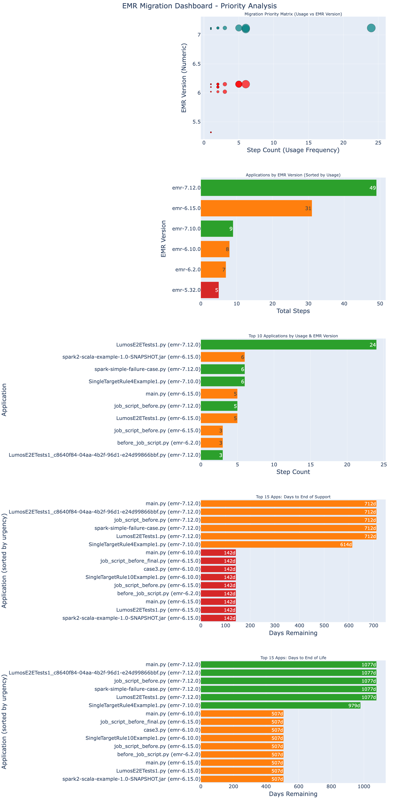

# EMR Migration Tool

A comprehensive all-in-one tool for analyzing and prioritizing Amazon EMR cluster migrations. Automatically assesses your EMR clusters, retrieves lifecycle dates, and generates an interactive dashboard to help you plan your migration strategy.

## Quick Start

### Installation

1. **Clone or download this repository**

2. **Install dependencies**
```bash
pip install -r requirements.txt
```

3. **Configure AWS credentials** (if not already configured)
```bash
aws configure
```

4. **Run the tool**
```bash
# Run assessment on all EMR clusters in us-east-1 with default credentials
python emr_migration_assessment_tool.py --region us-east-1
```

5. **Open the generated dashboard** in your browser: `emr_migration_dashboard.html`

## Requirements

- **Python 3.7+**
- **AWS Account** with EMR clusters
- **IAM Permissions**:
  - `emr:ListClusters`
  - `emr:DescribeCluster`
  - `emr:ListSteps`

### Python Dependencies
All dependencies are listed in `requirements.txt`:
- pandas
- plotly
- boto3
- requests
- beautifulsoup4
- lxml

## Features

### Automated Assessment
- Scans all EMR clusters in your AWS region
- Extracts application usage data from the last 30 days
- Identifies Spark versions and EMR versions in use

### Intelligent Lifecycle Tracking
- **Static lookup** for EMR versions ≤ 7.2.0
- **Web scraping** from AWS documentation for EMR versions ≥ 7.3.0
- Calculates days remaining until End of Support (EOS) and End of Life (EOL)

### Interactive Dashboard
5 comprehensive visualizations:
1. **Migration Priority Matrix** - Usage vs EMR version scatter plot
2. **Applications by EMR Version** - Total usage per version
3. **Top 10 Applications** - Highest usage applications
4. **Days to End of Support** - Top 15 apps sorted by urgency
5. **Days to End of Life** - Top 15 apps sorted by urgency

### Data Grouping
- Aggregates applications by **entrypoint script filename + EMR version**

## Usage

### Basic Usage

```bash
# Use default AWS credentials and region
python emr_migration_tool.py --region us-east-1
```

### With AWS Profile

```bash
# Use a specific AWS profile
python emr_migration_tool.py --profile my-aws-profile --region us-west-2
```

### Custom Output Paths

```bash
# Specify custom output file names
python emr_migration_tool.py \
  --region us-east-1 \
  --data-output my_emr_data.json \
  --dashboard-output my_dashboard.html
```

### Use Existing Data

```bash
# Skip assessment and use existing data file
python emr_migration_tool.py --data emr_data.json
```

### Get Help

```bash
python emr_migration_tool.py --help
```

## Understanding the Dashboard



### Color Coding

**EMR Version Colors:**
- 🔴 **Red**: EMR 5.x (oldest, highest migration priority)
- 🟠 **Orange**: EMR 6.x (medium priority)
- 🟢 **Green**: EMR 7.x (newest, lowest priority)

**Lifecycle Urgency Colors:**
- 🔴 **Red**: < 365 days remaining (urgent - migrate now)
- 🟠 **Orange**: 365-730 days remaining (plan migration)
- 🟢 **Green**: > 730 days remaining (low priority)

### Graph Descriptions

#### 1. Migration Priority Matrix (Scatter Plot)
- **X-axis**: Step count (total number of executions)
- **Y-axis**: EMR version (e.g., 5.36.0, 6.15.0, 7.1.0)
- **Bubble size**: Proportional to step count (larger = more usage)
- **Color**: Spark version (different colors for each Spark version)
- **Purpose**: Identify high-usage applications running on older EMR versions that need priority migration

#### 2. Applications by EMR Version (Bar Chart)
- **X-axis**: EMR version (e.g., emr-5.36.0, emr-6.15.0)
- **Y-axis**: Total step count across all applications
- **Color**: EMR version family (Red=5.x, Orange=6.x, Green=7.x)
- **Purpose**: Shows which EMR versions have the most overall activity

#### 3. Top 10 Applications (Horizontal Bar Chart)
- **X-axis**: Step count (number of executions)
- **Y-axis**: Application names (script filenames)
- **Color**: EMR version used by each application
- **Purpose**: Identifies your most frequently used applications and their EMR versions

#### 4. Days to End of Support (Horizontal Bar Chart)
- **X-axis**: Days remaining until End of Support
- **Y-axis**: Top 15 applications (sorted by urgency, fewest days first)
- **Color**: Urgency level (Red=urgent, Orange=moderate, Green=low priority)
- **Purpose**: Shows which applications need immediate attention for EOS compliance

#### 5. Days to End of Life (Horizontal Bar Chart)
- **X-axis**: Days remaining until End of Life
- **Y-axis**: Top 15 applications (sorted by urgency, fewest days first)
- **Color**: Urgency level (Red=urgent, Orange=moderate, Green=low priority)
- **Purpose**: Shows which applications need immediate attention for EOL compliance

## Output Files

### emr_data.json (or custom name)
JSON file containing:
- Application paths
- Spark versions
- EMR versions
- Step counts
- Last run timestamps
- Cluster IDs
- Region

### emr_migration_dashboard.html (or custom name)
Interactive HTML dashboard with:
- All 5 visualization graphs
- Hover tooltips with detailed information
- Responsive layout
- No external dependencies (fully self-contained)

## 🔄 Data Retention

The tool analyzes EMR steps from the **last 30 days**. To capture different time periods, modify the `one_month_ago` variable in the assessment function.