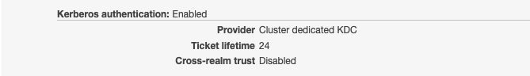

## EMR AD Authenticator
EMR AD Authenticator is a bootstrap action script to integrate Amazon EMR with Active Directory for user authentication. It installs SSSD on all EMR nodes and configures cross-realm trust with AD that doesn't require domain join.

## Why EMR AD Authenticator
When cross-realm trust is enabled for an EMR cluster in the EMR Security Configuration, SSSD gets installed and configured on all the nodes of the EMR cluster. The configuration that EMR uses for SSSD requires that all the EMR cluster nodes join the AD domain. https://docs.aws.amazon.com/emr/latest/ManagementGuide/emr-kerberos-cross-realm.html

There are scenarios in which customers cannot use this method to establish cross-realm trust with AD using EMR Security Configuration which requires domain join. For example, as Active Directory has a 15-character limit for registering joined computer names, it truncates longer names and there are chances that the truncated hostname of new ec2 instance will match the truncated hostname of an existing ec2-instance. In this scenario, when AD joins the new ec2-instance, it bumps up the keytab version and deploys it on the new ec2 machine as it already has a keytab for truncated computer name. This will invalidate authentication of older ec2-instance, resulting in application failures.

## How to use

### 1. Setup on Active Directory

Step 1: create a trust in Active Directory, which is a one-way, incoming, non-transitive, realm trust with the cluster-dedicated/external KDC. Here, the example we use for the cluster's realm is EC2.INTERNAL and AD Domain is emr.net.

Open the Windows command prompt with administrator privileges and type the following commands to create the trust relationship on the Active Directory domain controller:

```
C:\Users\Administrator> ksetup /addkdc EC2.INTERNAL KDC-FQDN
C:\Users\Administrator> netdom trust EC2.INTERNAL /Domain:emr.net /add /realm /passwordt:MyVeryStrongPassword
C:\Users\Administrator> ksetup /SetEncTypeAttr EC2.INTERNAL AES256-CTS-HMAC-SHA1-96
```

### 2. Setup on EMR

**Step 1: Use the Bootstrap Action Script for SSSD EMR-AD Integration**

i.  Modify emr_ad_auth.sh from Line 14 to 44 and save this script to your S3 location to be executed as a EMR bootstrap action.

```
 14 ####AD####
 15 # Active Directory domain name. Set this to your AD domain name.
 16 AD_DOMAIN='emr.net'
 17 AD_KRB5_REALM='EMR.NET'
 18 # FQDN of the AD domain controller. //hostname.ADdomainname
 19 AD_FQDN='EC2AMAZ-K9MA6F7.emr.net'
 20 
 21 ####AD BIND USER####
 22 # Set this to your ADMIN user
 23 BIND_USER='username'
 24 #Set your ADMIN password
 25 BIND_PASSWORD='bindpassword'
 26 #echo $BIND_PASSWORD
 27 
 28 # Set this to your ad/ldap search base
 29 LDAP_SEARCH_BASE='dc=emr,dc=net'
 30 
 31 ####EMR####
 32 # EMR VPC Domain Name
 33 EMR_DOMAIN='ec2.internal'
 34 # REALM of KDC
 35 EMR_KRB5_REALM='EC2.INTERNAL'
 36 # FQDN of the Cluster Dedicated KDC. For External KDC please comment the next two lines and uncooment the third line to set the external KDC FQDN
 37 CLUSTER_ID=`cat /mnt/var/lib/info/job-flow.json | jq -r ".jobFlowId"`
 38 ADMIN_SERVER=`aws emr list-instances --cluster-id $CLUSTER_ID --region us-east-1 --instance-group-types MASTER --query "Instances[0].PrivateDnsName" --output text`
 39 #ADMIN_SERVER=
 40 
 41 
 42 #CrossRealmTrustPassword-Set this to the trust password that you have created
 43 ## (Ref: https://docs.aws.amazon.com/emr/latest/ManagementGuide/emr-kerberos-cross-realm.html#emr-kerberos-ad-configure-trust)
 44 TRUST_PASS='MyVeryStrongPassword'
 45 
 46 #################################################################################
 ```

ii. Modify emr_ad_auth_wrapper.sh to point to emr_ad_auth.sh in S3. Save this script in S3.

**Step 2: Use the second bootstrap script 'create-hdfs-home-ba.sh' to create HDFS home directory for AD user when logging in**

**Step 3: Create an EMR security configuration with Kerberos authentication enabled**



**Note: Do not enable cross-realm trust in the EMR security configuration for this solution**

**Step 4: Add the mapping for Kerberos Principals to Usernames in EMR configuration**

*i.  In core-site, set hadoop.security.auth_to_local*

*ii. In kms-site, set hadoop.kms.authentication.kerberos.name.rules*

For example, 

```
[{"classification":"core-site", "properties":{"hadoop.security.token.service.use_ip":"true", "hadoop.security.auth_to_local":"RULE:[1:$1@$0](.*@EMR\\.NET)s/@.*///L RULE:[2:$1@$0](.*@EMR\\.NET)s/@.*///L DEFAULT"}, "configurations":[]},{"classification":"hadoop-kms-site", "properties":{"hadoop.kms.authentication.kerberos.name.rules":"RULE:[1:$1@$0](.*@EMR\\.NET)s/@.*///L RULE:[2:$1@$0](.*@EMR\\.NET)s/@.*///L DEFAULT"}, "configurations":[]}]
```

**Note: hadoop.security.auth_to_local configuration in core-site.xml needs to match exactly with hadoop.kms.authentication.kerberos.name.rules configuration in kms-site.xml**

**Step 5: Create the Kerberized EMR Cluster**

*Sample CLI*

```aws emr create-cluster --kerberos-attributes '{"KdcAdminPassword":"","Realm":"EC2.INTERNAL"}' --os-release-label 2.0.20220606.1 --applications Name=Hadoop Name=Spark --ec2-attributes '{"KeyName":"your-key","InstanceProfile":"EMR_EC2_DefaultRole","SubnetId":"subnet-xxxxxxxx","EmrManagedSlaveSecurityGroup":"sg-xxxxxxxx","EmrManagedMasterSecurityGroup":"sg-xxxxxxxx"}' --release-label emr-6.7.0 --log-uri 's3n://aws-logs-xxxxxxxxxxxx-us-east-1/elasticmapreduce/' --instance-groups '[{"InstanceCount":2,"EbsConfiguration":{"EbsBlockDeviceConfigs":[{"VolumeSpecification":{"SizeInGB":32,"VolumeType":"gp2"},"VolumesPerInstance":2}]},"InstanceGroupType":"CORE","InstanceType":"m5.xlarge","Name":"Core - 2"},{"InstanceCount":1,"EbsConfiguration":{"EbsBlockDeviceConfigs":[{"VolumeSpecification":{"SizeInGB":32,"VolumeType":"gp2"},"VolumesPerInstance":2}]},"InstanceGroupType":"MASTER","InstanceType":"m5.2xlarge","Name":"Master - 1"}]' --configurations '[{"Classification":"core-site","Properties":{"hadoop.security.token.service.use_ip":"true","hadoop.security.auth_to_local":"RULE:[1:$1@$0](.*@EMR\\.NET)s/@.*///L RULE:[2:$1@$0](.*@EMR\\.NET)s/@.*///L DEFAULT"}},{"Classification":"hadoop-kms-site","Properties":{"hadoop.kms.authentication.kerberos.name.rules":"RULE:[1:$1@$0](.*@EMR\\.NET)s/@.*///L RULE:[2:$1@$0](.*@EMR\\.NET)s/@.*///L DEFAULT"}}]' --auto-scaling-role EMR_AutoScaling_DefaultRole --bootstrap-actions '[{"Path":"s3://xxxxxxxx/bootstrap-actions/emr-kerberos-ad/emr_ad_auth_wrapper.sh","Name":"emr-ad-authenticator"},{"Path":"s3://xxxxxxxx/bootstrap-actions//emr-kerberos-ad/create-hdfs-home-ba.sh","Name":"Create HDFS home dir"}]' --ebs-root-volume-size 10 --service-role EMR_DefaultRole --security-configuration 'xxxxxxxxxxxxxxxxxxx' --enable-debugging --auto-termination-policy '{"IdleTimeout":7200}' --name 'emr_ad_authenticator_cluster' --scale-down-behavior TERMINATE_AT_TASK_COMPLETION --region us-east-1```

**Test: Once the cluster is up and running, check if you can ssh with an AD user, verify if the hdfs dir is created for the user and you are able to execute a sample job successfully with the user.**


## Troubleshooting

### Useful Logs
KDC log - /var/log/kerberos/krb5kdc.log
ldap log - /var/log/sssd/ldap_child.log
sssd log - /var/log/sssd/sssd_<ad_domain>.log

### Useful commands

Get FQDN - ```hostname -f```

Check AD DNS resolution ```nslookup emr.net```

Check if AD user information is retrieved in EMR - ```id <AD_username>```

To list keytab entry of /etc/krb5.keytab with encryption and timestamp- ```klist -kte /etc/krb5.keytab```

To list all principals - ```sudo kadmin.local -q "list_principals"```

To clear cached kerberos ticket - ```kdestroy```

To authenticate using keytab in verbose mode - ```sudo kinit -kt /etc/hdfs.keytab hdfs/ip-xxx-xx-xx-xx.ec2.internal@EC2.INTERNAL -V```

Run Sample Hadoop MapReduce Job - ```hadoop-mapreduce-examples pi 10 100```

Run Sample Spark Job - ```spark-submit --master yarn --deploy-mode cluster --class org.apache.spark.examples.SparkPi /usr/lib/spark/examples/jars/spark-examples.jar```


### Enable detailed log for Kerberos

Please enable verbose logging to troubleshoot kerberos issues when the error message is not helpful
```
export HADOOP_ROOT_LOGGER=DEBUG,console; export HADOOP_JAAS_DEBUG=true; export HADOOP_OPTS="-Dsun.security.krb5.debug=true -Dsun.security.spnego.debug=true"
```

### Common Errors

1)GSSAPI Error: Unspecified GSS failure.  Minor code may provide more information (KDC returned error string: GET_LOCAL_TGT)

* Solution: Check krb5 REALM name in EMR and the script

2)WARN kms.LoadBalancingKMSClientProvider: KMS provider at [http://ip-172-31-28-61.ec2.internal:9600/kms/v1/] threw an IOException: 
java.io.IOException: java.lang.reflect.UndeclaredThrowableException
      at org.apache.hadoop.crypto.key.kms.KMSClientProvider.getDelegationToken(KMSClientProvider.java:1051)

* Solution - Make sure hadoop.kms.authentication.kerberos.name.rules matches exactly with hadoop.security.auth_to_local configuration in core-site.xml

