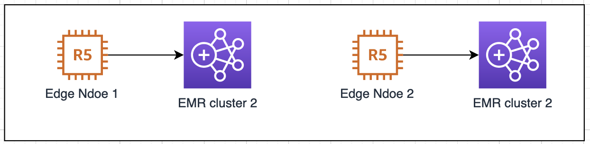
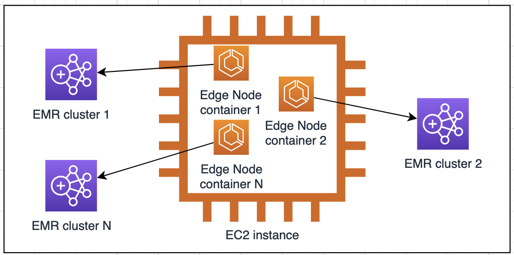

# EMR Edge Node Creator

Cloudformation and Docker-based tools to create an EC2 instance that acts as a user portal to communicate with an EMR cluster node. Users leverage the portal as their edge node or jump box to submit tasks to the EMR cluster.

## How to use the CFN tool (for usual edge node usage)



1. Deploy the tool via CFN
```
wget https://raw.githubusercontent.com/aws-samples/aws-emr-utilities/main/utilities/emr-edge-node-creator/create-edge-node-CFN.yml
```
Go to [CloudFormtaion Console](https://console.aws.amazon.com/cloudformation/home) to create the stack.

*Considerations:*
- Create the edge node in the same VPC as the EMR cluster. Use the same IAM role and security group that the EMR primary node uses.
- The docker host EC2 instance needs to be able to access EMR application ports. Potentially it can run multiple edge node client containers supporting different EMR versions.


2. Check the EMR step

Go to [EMR Console](https://us-east-1.console.aws.amazon.com/elasticmapreduce), select the EMR cluster you setup the edge node for. Check if the `CopyEMRConfigsStep` step is completed successfully.


3. Validate Edge Node 

SSH or use Session Manager login to the edge node EC2 instance. Use the Hadoop user:
```
sudo su hadoop
```

```
# test mapreduce
hadoop-mapreduce-examples pi 10 10000

# test hive if your EMR cluster has installed the Hive app
# you can see databases from Glue Catalog if Hive uses Glue as metastore
hive -e "show databases"

# test Presto if it is installed
presto-cli --catalog hive --schema YOUR_SCHEMA --debug --execute "show tables" --output-format ALIGNED

# test Spark if the app is installed
spark-submit --deploy-mode cluster /usr/lib/spark/examples/src/main/python/pi.py
# The output is saved in stdout log file
yarn logs -applicationId YOUR_APP_ID
```

## How to use the Docker tool (for consolidated edge node usage)



Some users run a large scale of edge nodes in a docker container environment, such as EKS or ECS. The tool allows you to run multiple edge node clients mapping to multiple EMR on EC2 clusters on a single EC2 instance. 

The benefits of this approach are:
- consolidation - you can group your edge nodes to a single or fewer EC2 instances, resulted in a simpler job scheduler design and reduced operational overhead.

- Isolation - the dockerized edge node client offers security isolation and optimal resource utilization. Granular access control via the [IRSA feature](https://docs.aws.amazon.com/eks/latest/userguide/iam-roles-for-service-accounts.html) in EKS. EC2-level Instance Profile role could made redundant.

- lower cost - edge node usually is a long-running instance. Running an edge node as a docker container or pod make the onDemand pricing model possible, ie. you can shut down when you don't need it. Only spin it up when you submit a task to your EMR cluster. The start-up time could be in seconds.

1. Run an EMR step to download client dependencies from the EMR cluster to S3 (on EMR console or using CLI)

```
JAR location: command-runner.jar

Arguments : "bash" "-c" "sudo rm -rf /tmp/emr_edge_node && sudo yum install git -y && git clone --depth 1 https://github.com/aws-samples/aws-emr-utilities.git /tmp/emr_edge_node && cd /tmp/emr_edge_node && git filter-branch --prune-empty --subdirectory-filter utilities/emr-edge-node-creator HEAD && chmod +x copy-emr-client-deps.sh && sudo copy-emr-client-deps.sh --s3-folder s3://YOUR_BUCKET/emr-client-deps/"
```

After the step run is completed, the client deps tarball will be available at:

s3://YOUR_ARTIFACT_BUCKET/emr-client-deps/emr-client-deps-YOUR_EMR_CLUSTER_ID.tar.gz

Or use AWS CLI (replace variable placeholders):
```
aws emr add-steps --cluster-id YOUR_EMR_CLUSTER_ID --steps Type=CUSTOM_JAR,Name=CopyEMRConfigsStep,ActionOnFailure=CANCEL_AND_WAIT,Jar=command-runner.jar,Args=["bash","-c","sudo rm -rf /tmp/emr_edge_node && sudo yum install git -y && git clone --depth 1 https://github.com/aws-samples/aws-emr-utilities.git /tmp/emr_edge_node && cd /tmp/emr_edge_node && git filter-branch --prune-empty --subdirectory-filter utilities/emr-edge-node-creator HEAD && bash copy-emr-client-deps.sh --s3-folder s3://YOUR_ARTIFACT_BUCKET/emr-client-deps/"] --region YOUR_REGION
```
2. Build the docker image or add to your Dockerfile then build
```
export AWS_REGION=us-east-1
export ACCOUNT_ID=$(aws sts get-caller-identity --query Account --output text)
export ECR_URL=$ACCOUNT_ID.dkr.ecr.$AWS_REGION.amazonaws.com

aws ecr get-login-password --region $AWS_REGION | docker login --username AWS --password-stdin $ECR_URL
aws ecr create-repository --repository-name emr-edgenode --image-scanning-configuration scanOnPush=true

docker build -t $ECR_URL/emr-edgenode .
docker push $ECR_URL/emr-edgenode
```

3. Setup a host to run the dockerized edge node

For the testing purpose, we use an EC2 instance to host one or multiple EMR Edge Node client containers (EC2 Console or CLI). If you have existing EKS or ECS workload, skip this step.

CLI approach:
```
# Choose a Linux AMI contains Docker daemon:
ami_id=$(aws ssm get-parameters --names /aws/service/ecs/optimized-ami/amazon-linux-2/recommended/image_id --query "Parameters[0].Value" --region $AWS_REGION --output text)

# create an EC2 (replace variable placeholders)
aws ec2 run-instances \
    --image-id $ami_id \
    --count 1 \
    --instance-type c5.2xlarge \
    --iam-instance-profile Name=EMR_EC2_DefaultRole \
    --security-group-ids $YOUR_EMR_MASTER_SG \
    --subnet-id $YOUR_EMR_SUBNET \
    --tag-specifications 'ResourceType=instance,Tags=[{Key=Name,Value=emr-edgenode}]' \
    --user-data sudo yum install -y aws-cli
```

4. Run an edge node client container
Make sure add the following ECR permission to your IRSA role or the instance profile role `EMR_EC2_DefaultRole`:
```
{
            "Sid": "AllowAddStep",
            "Effect": "Allow",
            "Action": [
                "ecr:Get*",
                "ecr:BatchGetImage"
            ],
            "Resource": "*"
  }
```

SSH or use Session Manager login to the EC2 instance, get the edge node client docker image:
```
sudo su
export AWS_REGION=us-east-1
export ACCOUNT_ID=$(aws sts get-caller-identity --query Account --output text)
export ECR_URL=$ACCOUNT_ID.dkr.ecr.$AWS_REGION.amazonaws.com

aws ecr get-login-password --region $AWS_REGION | docker login --username AWS --password-stdin $ECR_URL
docker pull $ECR_URL/emr-edgenode
```

```
# Start an edge node container. The gz file in S3 should be pre-generated by step 1
docker run -it -d --name emr-client $ECR_URL/emr-edgenode --emr-client-deps s3://YOUR_BUCKET/emr-client-deps/emr-client-deps-YOUR_EMR_CLUSTER_ID.tar.gz tail -f /dev/null

# OPTIONAL: run one more edge node mapping to a different EMR cluster
docker run -it -d --name emr-client2 $ECR_URL/emr-edgenode --emr-client-deps s3://YOUR_BUCKET/emr-client-deps/emr-client-deps-ANOTHER_EMR_CLUSTER_ID.tar.gz tail -f /dev/null
.....

# check if the emr-client container is up running.
docker ps
# check the setup progress.Usually it takes 2min.
docker logs emr-client
docker logs emr-client2
```

5. test apps on edge node container
```
docker exec -it emr-client hadoop-mapreduce-examples pi 10 10000
docker exec -it emr-client2 hadoop-mapreduce-examples pi 10 10000

# test hive if it is installed. It will list databases from Glue Catalog, if we use Glue as metastore
docker exec -it emr-client hive -e "show databases"
docker exec -it emr-client2 hive -e "show databases"

# test Presto if installed
docker exec -it emr-client presto-cli --catalog hive --schema default --debug --execute "show tables" --output-format ALIGNED
docker exec -it emr-client2 presto-cli --catalog hive --schema default --debug --execute "show tables" --output-format ALIGNED


# test Spark if installed
docker exec -it emr-client spark-submit --deploy-mode cluster /usr/lib/spark/examples/src/main/python/pi.py
docker exec -it emr-client2 spark-submit --deploy-mode cluster /usr/lib/spark/examples/src/main/python/pi.py

# The output is saved in stdout log file
docker exec -it emr-client yarn logs -applicationId YOUR_APP_ID
```

## How to re-sync the edge node

What if you made configuration change on your EMR cluster? Yes, the edge node needs to be refreshed. 

1. Re-run the EMR Step `CopyEMRConfigsStep`. Output the refreshed client dependencies and configs to a different file name. For example: `s3://${YOUR_S3BUCKET}/emr-client-deps/emr-client-deps-v2.tar.gz`

2. Reboot your edge node EC2 instance if you used the CFN tool. It automatically triggers the setup script. If the reboot is not an option, login to the instance and manually run the script:
```bash
bash /tmp/emr_edge_node/setup-emr-edge-node-s3.sh --emr-client-deps s3://${YOUR_S3BUCKET}/emr-client-deps/emr-client-deps-v2.tar.gz  
``` 

3. If you used the docker tool to setup edge nodes, simply rerun the script:
```bash
docker exec -it emr-client sbin/setup-emr-edge-node-s3.sh --emr-client-deps s3://${YOUR_S3BUCKET}/emr-client-deps/emr-client-deps-v2.tar.gz
```
