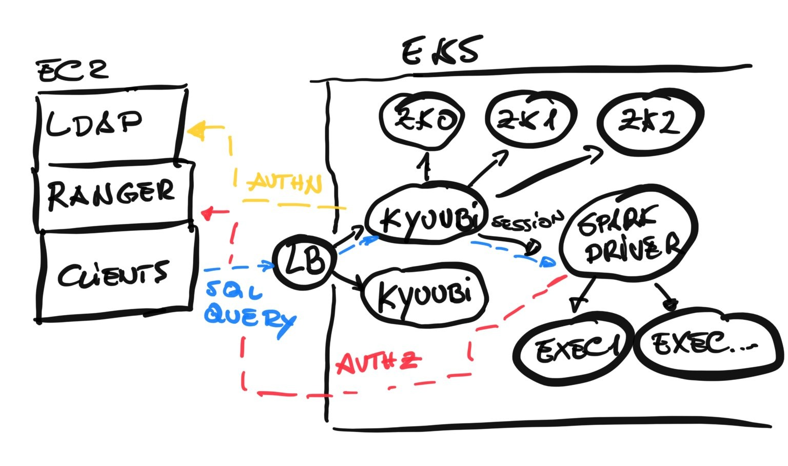
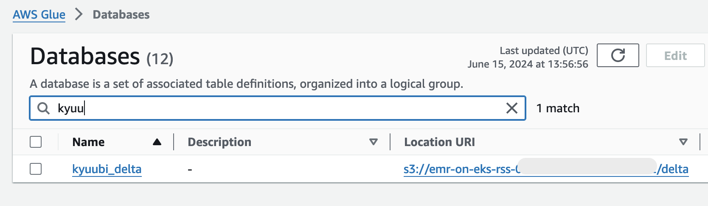
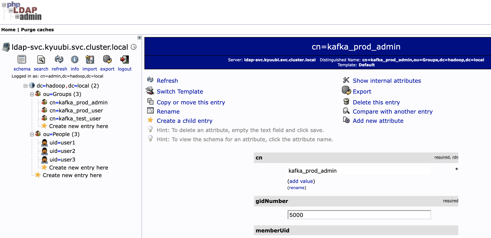
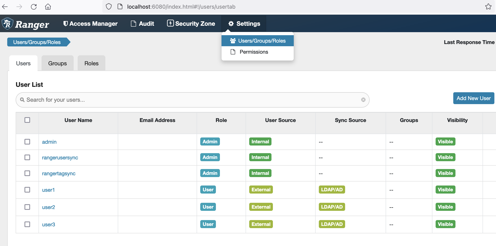
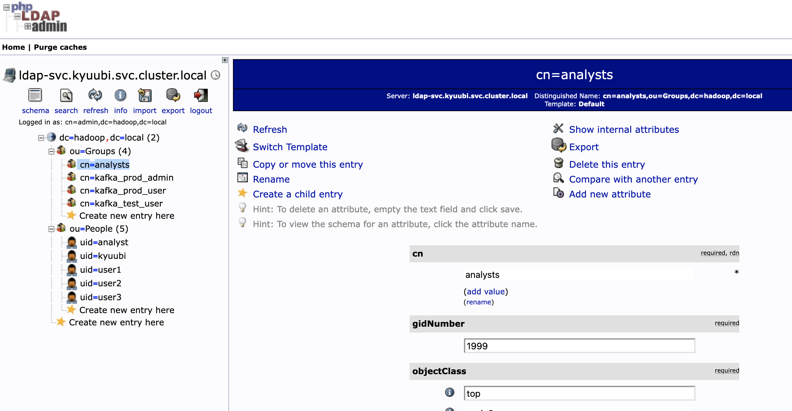
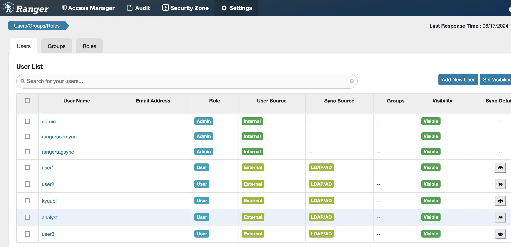
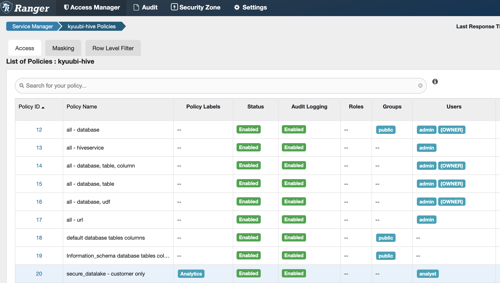

# EMR on EKS - Kyuubi

This project demonstrates the capabilities of [Apache Kyuubi](https://kyuubi.readthedocs.io/en/latest/index.html)
to create a unified SQL query layer that can be used to access different data
sources using Apache Spark as query engine.

In this project we're going to run Apache Kyuubi on EKS leveraging a customized EMR on EKS container image. It allows us to takes the advantage of an optimized EMR Spark runtime, while processing our SQL queries.

Besides, the project also provides scripts to install an OpenLDAP server, and an Apache Ranger Admin server to demonstrate how to integrate AuthN and AuthZ capabilities in Kyuubi.

The fundamental technical architecture of the solution is shown in the following diagram:



Kyuubi components running in a k8s environment:

```
meloyang ~/sourcecode/emr-on-eks-kyuubi (main) >> kubectl get all -n kyuubi
NAME           READY   STATUS    RESTARTS   AGE
pod/kyuubi-0   1/1     Running   0          3h18m
pod/kyuubi-1   1/1     Running   0          3h18m

NAME                           TYPE        CLUSTER-IP      EXTERNAL-IP   PORT(S)                                  AGE
service/kyuubi-headless        ClusterIP   None            <none>        3309/TCP,10099/TCP,10009/TCP,10010/TCP   3h18m
service/kyuubi-rest            ClusterIP   10.100.139.84   <none>        10099/TCP                                3h18m
service/kyuubi-thrift-binary   ClusterIP   10.100.146.98   <none>        10009/TCP                                3h18m

NAME                      READY   AGE
statefulset.apps/kyuubi   2/2     3h18m
```

## Setup environment
If you don't have your own environment to test the solution, run the following commands to setup the infrastructure you need. Change the region if needed.

### Prerequisite
- eksctl >= 0.143.0
- Helm CLI >= 3.2.1 
- kubectl >= 1.28.0 
- AWS Cli >= 2.11.23

To set up the infrastructure environment, run the following scripts in [AWS CloudShell](https://us-east-1.console.aws.amazon.com/cloudshell?region=us-east-1). The default region is `us-east-1`. **Change it on your console if needed**. Alternatively, setup the environment from your local computer.

```bash
# download the project
git clone https://github.com/aws-samples/aws-emr-utilities.git

cd aws-emr-utilities/utilities/emr-on-eks-kyuubi
echo $AWS_REGION
````
Run the script to install required CLI tools: eksctl,helm CLI,kubectl. Skip this step if you have these command tools.
```bash
./scripts/cli_setup.sh
```
Create a new EKS cluster and enable EMR on EKS:
```bash
# param1: EKS CLUSTER NAME, default: 'eks-kyuubi'
# param2: Deployment region, default: 'us-east-1'
./scripts/eks_provision.sh
```
OR
```bash
./scripts/eks_provision.sh  <YOUR_EKS_NAME> <YOUR_AWS_REGION>
```

## Quick Start

### Build a custom EMR on EKS image that contains Kyuubi

```bash
ACCOUNT_ID=$(aws sts get-caller-identity --query Account --output text)
AWS_REGION=us-west-2
ECR_URL=$ACCOUNT_ID.dkr.ecr.$AWS_REGION.amazonaws.com

aws ecr get-login-password --region us-east-1 | docker login --username AWS --password-stdin 755674844232.dkr.ecr.us-east-1.amazonaws.com
aws ecr get-login-password --region $AWS_REGION | docker login --username AWS --password-stdin $ECR_URL

# create a new repository in your ECR, **ONE-OFF task**
aws ecr create-repository --repository-name $ECR_URL/kyuubi-emr-eks --image-scanning-configuration scanOnPush=true

# create a builder for multi-platform build
docker buildx create --name kyuubi-builder --driver docker-container --bootstrap

# make sure the docker daemon file(/etc/docker/daemon.json) has the following settings, if modify the file, restart the docker daemon

#{
#	"features": {
#		"containerd-snapshotter": true
#	}
#}

# image build and push. It takes approx. 40mins
docker buildx build --platform linux/amd64,linux/arm64 \
-t $ECR_URL/kyuubi-emr-eks:emr6.15_kyuubi1.8 \
-f dockers/kyuubi/Dockerfile \
--build-arg SPARK_BASE_IMAGE=755674844232.dkr.ecr.us-east-1.amazonaws.com/spark/emr-6.15.0 \
--build-arg KYUUBI_VERSION=1.8.0 \
--build-arg SPARK_VERSION=3.4.1 \
--build-arg RANGER_VERSION=2.4.0 \
--builder kyuubi-builder \
--push .
```

### Helm install Kyuubi
1. Edit the chart's [my-kyuubi-values.yaml](./charts/my-kyuubi-values.yaml) file. The following settings in the file need to consider to change:
- Replace Kyuubi's public container image repository and tag values by yours from a private container repository, for example `$ECR_URL/kyuubi-emr-eks:6.15_kyuubi1.8`. 
- Also update the image URL in Spark's default setting `spark.kubernetes.container.image`.
- Change the `spark.kubernetes.file.upload.path` value and map to an accessable S3 bucket defined by your IRSA linked to your Kyuub's SA.

```bash
vi charts/my-kyuubi-values.yaml
```
In this file, few more Spark default configs need to pay attention to. Change them based on your EKS environment setup.
```bash
# a namespace to run Spark or EMR on EKS workload
spark.kubernetes.namespace=emr
# Kyuubi's service account that has permisison to access the EMR's namespace
spark.kubernetes.authenticate.serviceAccountName=cross-ns-kyuubi
# SA in EMR's namespace
spark.kubernetes.authenticate.driver.serviceAccountName=emr-kyuubi
```    

2. Install Kyuubi
```bash
helm install kyuubi charts/kyuubi -n kyuubi --create-namespace -f charts/my-kyuubi-values.yaml --debug
# check the installation progress
kubectl get all -n kyuubi
```
Uninstall this chart if needed:
```bash
helm uninstall kyuubi -n kyuubi
kubectl delete sa,cm,svc -n kyuubi
# don't forget to delete cm,role and rolebinding in EMR on EKS's namespace created by the Kyuubi chart
```

3. To enable Kyuubi create Spark pods in a different namespace "emr" (EMR on EKS namespace in this example), ensure the "cross-ns-kyuubi" Service Account bind a role in the "emr" namespace. 
```bash
kubectl describe rolebinding kyuubi-emr -n emr
```
Expected outcome is:
```yaml
Name:         kyuubi-emr
............
Role:
  Kind:  Role
  Name:  kyuubi-emr
Subjects:
  Kind            Name             Namespace
  ----            ----             ---------
  ServiceAccount  cross-ns-kyuubi  kyuubi
```

### Quick start
To test the installation, firstly, login to a Kyuubi server pod.
```bash
kubectl exec -it pod/kyuubi-0 -n kyuubi -- bash
```

1. Submit a SparkPi job from Kybuui server to EMR on EKS namespace
```bash
spark-submit \
--master k8s://https://kubernetes.default.svc:443 \
--deploy-mode cluster \
--class org.apache.spark.examples.SparkPi \
--conf spark.executor.instances=5 \
 local:///usr/lib/spark/examples/jars/spark-examples.jar 10000
```

```yaml
~/sourcecode/emr-on-eks-kyuubi (main) >> kubectl get po -n emr -w
NAME                                                        READY   STATUS    RESTARTS   AGE
org-apache-spark-examples-sparkpi-1dc1958e8b4c5001-driver   1/1     Running   0          8s
spark-pi-0672778e8b4c63ed-exec-1                            1/1     Running   0          3s
spark-pi-0672778e8b4c63ed-exec-2                            1/1     Running   0          3s
spark-pi-0672778e8b4c63ed-exec-3                            1/1     Running   0          3s
spark-pi-0672778e8b4c63ed-exec-4                            1/1     Running   0          3s
spark-pi-0672778e8b4c63ed-exec-5                            1/1     Running   0          3s
```

2. Connect to the Kyuubi server via Thrift (HiveServer2 compatible) and create a Delta lake interactively.

Your kyuubi pods should be able to access to an S3 bucket via EKS's IRSA feature. To validate the permission, find your IAM role name from this command first:
```bash
kubectl describe sa cross-ns-kyuubi -n kyuubi
```
Once confirmed that you have the required access to S3, let's login to the Kyuubi pod again and create a sample delta table mapping to the s3 bucket. Before the authentication is enabled, we can login with any random username.

```bash
./bin/beeline -u 'jdbc:hive2://kyuubi-thrift-binary:10009?spark.app.name=testdelta' -n any_name
```
3. The sample database and table are in Delta format, which should map to an S3 bucket that you have access to. In the Glue console, you should be able to see the related metadata generated in AWS Glue Data Catalog under the database `kyuubi_delta` with a S3 location.

 

```yaml
0: jdbc:hive2://kyuubi-thrift-binary.kyuubi:10009> CREATE DATABASE IF NOT EXISTS kyuubi_delta LOCATION 's3://YOUR_S3_BUCKET/kyuubi-delta';
......
0: jdbc:hive2://kyuubi-thrift-binary.kyuubi:10009> USE kyuubi_delta;
......
0: jdbc:hive2://kyuubi-thrift-binary.kyuubi:10009> CREATE TABLE table_with_col USING DELTA AS SELECT col1 as id FROM VALUES 0,1,2,3,4;
......
+---------+
| Result  |
+---------+
+---------+
No rows selected (5.32 seconds)
0: jdbc:hive2://kyuubi-thrift-binary.kyuubi:10009> show tables;
+---------------+-----------------+--------------+
|   namespace   |    tableName    | isTemporary  |
+---------------+-----------------+--------------+
| kyuubi_delta  | table_with_col  | false        |
+---------------+-----------------+--------------+
1 row selected (0.325 seconds)
0: jdbc:hive2://kyuubi-thrift-binary.kyuubi:10009> SELECT * FROM table_with_col;
+-----+
| id  |
+-----+
| 2   |
| 3   |
| 4   |
| 0   |
| 1   |
+-----+
5 rows selected (1.74 seconds)

0: jdbc:hive2://kyuubi-thrift-binary.kyuubi.s> !quit
```

## Kyuubi Security
Securing Kyuubi involves enabling authentication(authn), authorization(authz) in this example. 

### Install OpenLDAP (authentication)
LDAP is commonly used for user authentication against corporate identity servers that are hosted on applications such as Active Directory (AD) and OpenLDAP. In this example, we will use the OpenLDAP to test the Kyuubi's AuthN capability.

Let's install the OpenLDAP helm chart, which will be used to provide a strong authentication capability while using Kyuubi.
```bash
helm install ldap charts/openldap -f charts/openldap/values.yaml -n kyuubi --debug
# list all the bjects created by the helm chart
kubectl get all -l "release=ldap" -n kyuubi
```
Ater 2 to 3 mintues, test the connection to the LDAP server. If it fails, wait for another minute before run the test again.
```bash
helm test ldap -n kyuubi
```
This Helm Chart installs a LDAP server plus a web app 'phpLDAPadmin' administering the LDAP server. To login to the admin UI, we need to port-forward first. Create an ingress object in the helm chart if you don't want to create the SSH tunnel manually.
```bash
# ssh tunneling
kubectl port-forward service/ldap-php-svc 8080:8080 -n kyuubi
# URL: http://localhost:8080/
# login: cn=admin,dc=hadoop,dc=local
# password: admin
```
To demonstrate that ranger can sync up with the LDAP, we have pre-created 3 groups - kafka_test_user,kafka_prod_user,kafka_prod_admin and 3 users - user1,user2,user3 at the launch time.




### Install Ranger Admin Server (authorization)
When row/column-level fine-grained access control is required, we can stronger the data access with the Kyuubi Spark AuthZ Plugin. The plugin provides the fine-grained ACL management for data & metadata while using Spark SQL as the engine in Kyuubi.

Apache Ranger enables Kyuubi with data and metadata ACL for Spark SQL, including:

- Column-level fine-grained authorization
- ow-level fine-grained authorization, a.k.a. Row-level filtering
- Data masking

Using the same way to install the Ranger Admin Server: 

```bash
helm install ranger charts/ranger -f charts/ranger/values.yaml -n kyuubi --debug
```
After the Ranger server is started, the build-in Usersync component begins synchronizing users and groups from the LDAP to Ranger. To validate, do the SSH tunneling to a ranger pod before access its web interface:
```bash
# ssh tunneling
kubectl port-forward ranger-0 -n kyuubi 6080:6080
# URL: http://localhost:6080
# username: admin  
# password: Rangeradmin1!
```


We have now deployed Kyuubi secured by LDAP and Ranger. They look like this in the kyuubi namepsace.
```bash
meloyang emr-on-eks-kyuubi (main) >> kubectl get all -n kyuubi
NAME                                  READY   STATUS      RESTARTS   AGE
pod/kyuubi-0                          1/1     Running     0          4m35s
pod/kyuubi-1                          1/1     Running     0          3m5s
pod/ldap-5d7944d69f-lhthz             1/1     Running     0          13h
pod/ldap-php-7dc58987b-kjhg4          1/1     Running     0          13h
pod/ldap-test-ohnbq                   0/1     Completed   0          4h24m
pod/ranger-0                          1/1     Running     0          14m
pod/ranger-es-df7495899-vmx5t         1/1     Running     0          14m
pod/ranger-postgresdb-0               1/1     Running     0          14m
pod/ranger-usersync-cdcd69466-rxkt7   1/1     Running     0          14m

NAME                               TYPE        CLUSTER-IP       EXTERNAL-IP   PORT(S)                                  AGE
service/kyuubi-headless            ClusterIP   None             <none>        3309/TCP,10099/TCP,10009/TCP,10010/TCP   4m47s
service/kyuubi-rest                ClusterIP   10.100.55.212    <none>        10099/TCP                                4m47s
service/kyuubi-thrift-binary       ClusterIP   10.100.50.174    <none>        10009/TCP                                4m47s
service/ldap-php-svc               ClusterIP   10.100.251.247   <none>        8080/TCP                                 13h
service/ldap-svc                   ClusterIP   10.100.22.88     <none>        389/TCP,636/TCP                          13h
service/ranger-es-svc              ClusterIP   10.100.173.199   <none>        9200/TCP                                 14m
service/ranger-headless            ClusterIP   None             <none>        6080/TCP                                 14m
service/ranger-postgres-headless   ClusterIP   None             <none>        5432/TCP                                 14m

NAME                              READY   UP-TO-DATE   AVAILABLE   AGE
deployment.apps/ldap              1/1     1            1           13h
deployment.apps/ldap-php          1/1     1            1           13h
deployment.apps/ranger-es         1/1     1            1           14m
deployment.apps/ranger-usersync   1/1     1            1           14m

NAME                                        DESIRED   CURRENT   READY   AGE
replicaset.apps/ldap-5d7944d69f             1         1         1       13h
replicaset.apps/ldap-php-7dc58987b          1         1         1       13h
replicaset.apps/ranger-es-df7495899         1         1         1       14m
replicaset.apps/ranger-usersync-cdcd69466   1         1         1       14m

NAME                                 READY   AGE
statefulset.apps/kyuubi              2/2     4m47s
statefulset.apps/ranger              1/1     14m
statefulset.apps/ranger-postgresdb   1/1     14m
```

### Enable the security in Kyuubi

It's time to configure the LDAP and Ranger for Kyuubi.

1. Add new users & groups in LDAP
Login to a ldap pod and run the following setup script. It creates 2 new users `kyuubi` and `analyst` under a new group in the "hadooop.local" domain. The usage looks like this: ./ldap_install.sh <ADMIN_PASSWD> <USER_LIST> <USER_PASSWD> <BASE_DIRECTORY> .
```bash
# Login to the pod
export ldap_pod_name=`kubectl get pods -n kyuubi | awk '/ldap-/ {print $1;exit}'`
kubectl exec -it $ldap_pod_name -n kyuubi -- bash
```
```bash
# install the curl tool first
apt update
apt install -y curl
# create new user and group
curl https://raw.githubusercontent.com/aws-samples/aws-emr-utilities/main/utilities/emr-on-eks-kyuubi/scripts/ldap_setup.sh | bash  -s -- "admin" "kyuubi,analyst" "Password123!" "dc=hadoop,dc=local"
```
Port forwarding your LDAP PHP service 'ldap-php-svc' again and refresh the Admin Web UI:


2. Check Ranger WebUI after the auto sync-up occurs:
```bash
# ssh tunneling
kubectl port-forward ranger-0 -n kyuubi 6080:6080
# url : localhost:6080
# login: admin
# password: Rangeradmin1!
```
By default, it sync-up every hour. Without a wait, let's directly delete the usersync pod that forces to resync the incremental changes from the LDAP server.
```bash
# delete the current pod
export usersync_pod_name=`kubectl get pods -n kyuubi | awk '/usersync/ {print $1;exit}'`
kubectl delete $usersync_pod_name -n kyuubi --force

# check the sync up logs from the newly created pod
export usersync_pod_name2=`kubectl get pods -n kyuubi | awk '/usersync/ {print $1;exit}'`
kubectl logs $usersync_pod_name2 -n kyuubi -f
```


3. Redeploy Kyuubi chart with security enabled

Enabling LDAP - Edit the Kyuubi's value file [./charts/my-kyuubi-values.yaml](./charts/my-kyuubi-values.yaml). Uncomment the lines for LDAP setup in the kyuubiDefaults settings (line#56-62) and modify them accordingly.

Enabling Ranger - Edit the config files in [./charts/kyuubi/security](./charts/kyuubi/security). Make sure all the settings are correct.

Redeploy the chart with security configs:
```bash
helm upgrade --install kyuubi charts/kyuubi -n kyuubi -f charts/my-kyuubi-values.yaml --debug
# watch kyuubi's pods rolling update
kubectl get po -n kyuubi -w
```
You can repeat the above command whenever the configurations from those files are adjusted. Before proceed to the next step, make sure your Kyuubi pods are replaced by new ones after the upgrade judging by the "AGE" column from your kubectl output.

## Testing

### Validate the Authentication (LDAP) in Kyuubi
Once LDAP in Kyuubi is enabled, you won't be able to run the Beenline tool by any user name as before. Instead you only can access it via the LDAP users - for example, the 'kyuubi' or 'analyst' user that was created earlier. Let's take the 'user1' user as an example. Refer to these Kafka user's setup in the [groups.ldif](./charts/openldap/ldifs/groups.ldif) config file:
```bash
# ssh to any one of kyuubi pods that has been restarted
kubectl exec -it pod/kyuubi-1 -n kyuubi -- bash
# run the beeline with a random username with an error returned
./bin/beeline -u 'jdbc:hive2://kyuubi-thrift-binary:10009?spark.app.name=testldap' -n blah -p Password123
# Error: Could not open client transport with JDBC Uri: jdbc:hive2://kyuubi-thrift-binary:10009?spark.app.name=testldap: Peer indicated failure: Error validating the login (state=08S01,code=0)
```
Try again with the correct login credential:
```bash
./bin/beeline -u 'jdbc:hive2://kyuubi-thrift-binary:10009?spark.app.name=testldap' -n user1 -p Password123!
```
```bash
0: jdbc:hive2://kyuubi-thrift-binary:10009> select * from kyuubi_delta.table_with_col;
+-----+
| id  |
+-----+
| 2   |
| 3   |
| 4   |
| 0   |
| 1   |
+-----+
```

### Create sample datasets
Let's create a sample dataset on S3 that is secured by Ranger policies. 
```bash
# login to one of kyuubi instances in EKS
kubectl exec -it pod/kyuubi-0 -n kyuubi -- bash

# after login to the kyuubi pod, spin up the spark shell
spark-shell --master local --deploy-mode client
# spark-shell --master local --deploy-mode client --conf spark.jars=/usr/lib/kyuubi/externals/engines/spark/kyuubi-spark-sql.jar,/usr/lib/kyuubi/externals/engines/spark/kyuubi-spark-authz.jar
```

The following code snippet creates two sample tables - customer and store_sales, mapping to the S3 bucket that you have access to. Your Kyuubi has been pre-configured via the [charts/kyuubi/my-kyuubi-valeus.yaml](./charts/kyuubi/my-kyuubi-valeus.yaml) to use AWS Glue Data Catalog as its metastore. In the Glue console, you should be able to see the related table metadata is generated under the new database `secure_datalake`. 

Replace the "s3_location" to you own, then run the following commands:
```scala
val s3_location = "s3://YOUR_S3_BUCKET/secure-datalake/"
spark.sql(s"CREATE DATABASE IF NOT EXISTS secure_datalake LOCATION '$s3_location'")

val customer = Seq(
  (1, "Lorenzo", "Dr", "lorenzodr@example.com", 1000),
  (2, "Jeff", "Bezos", "jeff@example.com", 400000000),
  (3, "Tom", "Brady", "tom@example.com", 10000000)
).toDF("id", "first_name","last_name","mail","balance")

val store_sales = Seq(
  (1, 1, 10),
  (1, 2, 1230),
  (1, 2, 5090),
  (1, 3, 498)
).toDF("id", "c_id","price")

// Common Parquet table
customer.write.format("parquet").mode("overwrite").saveAsTable("secure_datalake.customer")
store_sales.write.format("parquet").mode("overwrite").saveAsTable("secure_datalake.store_sales")

// check data
spark.sql("SELECT * FROM secure_datalake.customer").show
spark.sql("SELECT * FROM secure_datalake.store_sales").show
```
The outputs are :
```scala
scala> spark.sql("SELECT * FROM secure_datalake.customer").show
+---+----------+---------+--------------------+---------+                       
| id|first_name|last_name|                mail|  balance|
+---+----------+---------+--------------------+---------+
|  1|   Lorenzo|       Dr|lorenzodr@example...|     1000|
|  2|      Jeff|    Bezos|    jeff@example.com|400000000|
|  3|       Tom|    Brady|     tom@example.com| 10000000|
+---+----------+---------+--------------------+---------+

scala> spark.sql("SELECT * FROM secure_datalake.store_sales").show
+---+----+-----+
| id|c_id|price|
+---+----+-----+
|  1|   1|   10|
|  1|   2| 1230|
|  1|   2| 5090|
|  1|   3|  498|
+---+----+-----+
```

### Add Ranger Policies

Finally we create the Ranger policies to test the fine-grained access of the tables created above. Launch the script `ranger_policies.sh` on a ranger pod :
```bash
# login to the Ranger Admin Server pod
kubectl exec -it pod/ranger-0  -n kyuubi -- bash
# create policies in Ranger
curl https://raw.githubusercontent.com/aws-samples/aws-emr-utilities/main/utilities/emr-on-eks-kyuubi/scripts/ranger_policies.sh | bash
```

The policies created gives access to the analyst user to query the `customer` table only, but applies a data mask on the column `mail`.

Use the same appraoch to validate the Ranger policy update via the web UI:
```bash
# ssh tunneling
kubectl port-forward ranger-0 -n kyuubi 6080:6080
# url : localhost:6080
# login: admin
# password: Rangeradmin1!
```



### Validate the fine-grained access against the secured datalake

To test everything is fully secured, connect to beeline via two user logins "analyst" & "kyuubi". You will see different outcome based on their permission setup in Ranger. To be able to compare the security feature, we add the Spark config `spark.sql.extensions=org.apache.kyuubi.plugin.spark.authz.ranger.RangerSparkExtension` to the beeline's conneciton string. In the real-world practice, to reinforce the security control, it is recommended to set it as a Spark default in the helm chart value file ["my-kyuubi-values.yaml"](./charts/my-kyuubi-values.yaml) before install the Kyuubi chart. 

```bash
# login to one of kyuubi instances in EKS
kubectl exec -it pod/kyuubi-0 -n kyuubi -- bash
# without setting up the authZ plugin, the fine-grained access policy won't apply to the session.
# both tables should appear if run the "SHOW TABLES IN secure_datalake;" command
./bin/beeline -u 'jdbc:hive2://kyuubi-thrift-binary:10009?spark.app.name=tesfgac' -n analyst -p Password123!

# test the fine-grained access control with the authZ plugin
./bin/beeline -u 'jdbc:hive2://kyuubi-thrift-binary:10009?spark.app.name=tesfgac;spark.sql.extensions=org.apache.kyuubi.plugin.spark.authz.ranger.RangerSparkExtension' -n analyst -p Password123!
```
```sql
-- this will display only one tables as we granted read permissions only for the
-- customer table. Ranger filters metadata accordingly.
SHOW TABLES IN secure_datalake;

-- This will print the customer data with an hash in the mail column (data mask)
SELECT * FROM secure_datalake.customer;

-- This query should fail as we do not have permissions to access the table
-- Permission denied: user [analyst] does not have [select] privilege on ...
SELECT * FROM secure_datalake.store_sales;
```

```bash
# no table returns, as we didn't grant read permissions to the kyuubi user.
./bin/beeline -u 'jdbc:hive2://kyuubi-thrift-binary:10009?spark.app.name=tesfgac;spark.sql.extensions=org.apache.kyuubi.plugin.spark.authz.ranger.RangerSparkExtension' -n kyuubi -p Password123!
```
```bash
0: jdbc:hive2://kyuubi-thrift-binary:10009> SHOW TABLES IN secure_datalake;
+------------+------------+--------------+
| namespace  | tableName  | isTemporary  |
+------------+------------+--------------+
+------------+------------+--------------+
No rows selected (0.973 seconds)
0: jdbc:hive2://kyuubi-thrift-binary:10009>
```

## Clean Up

To uninstall all of charts, simply run the 4 commands to remove all the object from the kyuubi namespace:
```bash
helm uninstall kyuubi -n kyuubi
helm uninstall ranger -n kyuubi
helm uninstall ldap -n kyuubi
# delete the namespace
kubectl delete ns -n kyuubi
```
