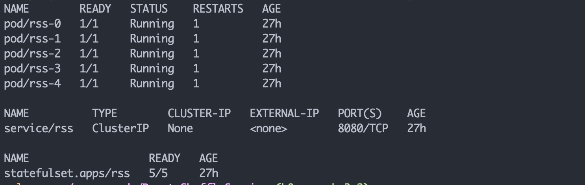

# Remote Shuffle Service Helm Chart

The Helm chart helps you to simplify the installation of [Remote Shuffle Service (RSS)](https://github.com/uber/RemoteShuffleService) server on k8s.

Get the Helm command line tool:
```
sudo yum install openssl && curl -sSL https://raw.githubusercontent.com/helm/helm/master/scripts/get-helm-3 | bash
helm version --short
```

## How to use the chart

Command example to install:
```
helm install rss charts/remote-shuffle-service --namespace remote-shuffle-service --create-namespace --debug

```

## Consideration

### Storage

By defualt, RSS server uses root volume to store shuffle data. However, this is not ideal. In the [charts/remote-shuffle-service/values.yaml](./values.yaml), we exposed the volume settings to users. So RSS now can use NVMe SSD instance storage, or mounted EFS or shared Amazon FSx for Lustre storage. Currently, RSS only supports a single disk.

### Node selection
In [charts/remote-shuffle-service/values.yaml](./values.yaml), there is a nodeSelector setting, which means the RSS Server only be installed on nodes/EC2 instances that have the label of `app=rss` in order to assign a sepcific EC2 instance types with a single SSD disk, `c5d.9xlarge` in this case. Change the label name accorddingly.
```
nodeSelector:
    app: rss
```    
### storage security

In [charts/remote-shuffle-service/values.yaml](./values.yaml), you can see the following securityContext is configurable. 
```
securityContext:
  runAsGroup: 0
  runAsUser: 0

# configure the shuffle service volume owner as Hadoop user (EMR on EKS is 999:1000, OSS Spark is 1000:1000)
volumeUser: 999
volumeGroup: 1000
```

We run the shuffle service under a Hadoop user, however as a root user who needs to create a folder for the volume user `Hadoop user` first. Be aware of that Hadoop User ID in EMR on EKS is `999` but OSS Spark is `1000`.

### autoscaling

the RSS Server is a statefulset, which provides the high availability feataure with autoscaling. It can scale from 1 to N number of pods based on your replicas setting in the [values.yaml](./values.yaml) file. In this repo, we set replicas to 2 instances, with the name of rss-[index number] from 0 to 1. For example: `rss-0`

```
replicas: 3
```
To scale out, for example to 5 instances, simply run the command:
```
kubectl scale statefulsets rss -n remote-shuffle-service  --replicas=5
```
