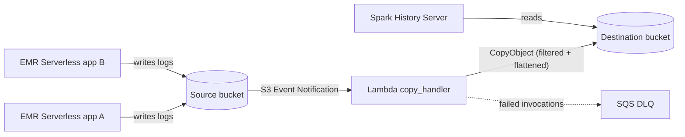

# EMR Serverless Unified History Server

Run a **single Spark History Server** that shows every job from **all** your EMR
Serverless applications — regardless of how many applications you use.

## Problem

EMR Serverless writes each job run's Spark event log under a deeply nested,
per-application, per-run S3 path:

```
s3://<log-bucket>/logs/applications/<app-id>/jobs/<job-run-id>/sparklogs/eventlog_v2_<job-run-id>/...
```

A Spark History Server reads one flat log directory
(`spark.history.fs.logDirectory`). Because every application and job run uses a
different prefix, there is no single directory an SHS can point at — so there is
no unified view across applications.

This is a regression for teams migrating from EMR on EC2, where the long-lived
cluster's History Server showed every job in one place.

## Solution

An event-driven pipeline that aggregates Spark event logs in near real-time:

```
EMR-S app A ─┐
EMR-S app B ─┼─▶ s3://SRC/logs/applications/<app-id>/jobs/<run-id>/sparklogs/eventlog_v2_<run-id>/...
EMR-S app C ─┘            │
                          │  S3 Event Notification (s3:ObjectCreated:*)
                          ▼
                   Lambda copy_handler ── server-side CopyObject ──▶ s3://DST/logs/eventlog_v2_<run-id>/...
                                                                              ▲
                                         Spark History Server ────────────────┘
                                         spark.history.fs.logDirectory=s3://DST/logs/
```

The Lambda:
1. **Filters** — only objects whose key contains `/sparklogs/` are processed;
   driver/executor logs are skipped
2. **Flattens** — rewrites the key by dropping everything before `sparklogs/`,
   so all runs land in one directory (job-run IDs are globally unique — no collisions)
3. **Copies server-side** — `CopyObject` moves bytes within S3; the Lambda never
   downloads data, so duration is independent of file size and same-region
   transfer is free

## Architecture



## Deployment

### Prerequisites

- AWS CLI configured with appropriate credentials
- An EMR Serverless application with `logUri` pointing to an S3 bucket

### Deploy the CloudFormation stack

```bash
export STACK=emr-serverless-unified-shs
export SRC_BUCKET=my-emr-logs-source-$(aws sts get-caller-identity --query Account --output text)
export DST_BUCKET=my-emr-logs-dest-$(aws sts get-caller-identity --query Account --output text)

aws cloudformation deploy \
  --stack-name "$STACK" \
  --template-file template.yaml \
  --capabilities CAPABILITY_IAM \
  --parameter-overrides \
      SourceBucketName="$SRC_BUCKET" \
      DestinationBucketName="$DST_BUCKET" \
      LogPrefix=logs/applications/ \
      DestinationPrefix=logs/
```

### Configure EMR Serverless to write logs to the source bucket

Set `monitoringConfiguration.s3MonitoringConfiguration.logUri` to
`s3://<SRC_BUCKET>/logs/` when creating or running your EMR Serverless
application/job.

### Set up the Spark History Server

Point any SHS (EC2, container, or local) at the destination bucket:

```properties
# spark-defaults.conf
spark.history.fs.logDirectory=s3a://<DST_BUCKET>/logs/
spark.hadoop.fs.s3a.aws.credentials.provider=com.amazonaws.auth.InstanceProfileCredentialsProvider
spark.history.fs.update.interval=10s
```

<details>
<summary>EC2 setup from scratch (Amazon Linux 2023)</summary>

```bash
sudo dnf install -y java-17-amazon-corretto-headless
curl -sSLo /tmp/spark.tgz https://archive.apache.org/dist/spark/spark-3.5.6/spark-3.5.6-bin-hadoop3.tgz
sudo tar xzf /tmp/spark.tgz -C /opt && sudo ln -s /opt/spark-3.5.6-bin-hadoop3 /opt/spark

# S3A jars (versions must match Spark's bundled Hadoop 3.3.4)
cd /opt/spark/jars
sudo curl -sSLO https://repo1.maven.org/maven2/org/apache/hadoop/hadoop-aws/3.3.4/hadoop-aws-3.3.4.jar
sudo curl -sSLO https://repo1.maven.org/maven2/com/amazonaws/aws-java-sdk-bundle/1.12.262/aws-java-sdk-bundle-1.12.262.jar

# Configure and start
cat <<EOF | sudo tee /opt/spark/conf/spark-defaults.conf
spark.history.fs.logDirectory=s3a://${DST_BUCKET}/logs/
spark.hadoop.fs.s3a.aws.credentials.provider=com.amazonaws.auth.InstanceProfileCredentialsProvider
spark.history.fs.update.interval=10s
EOF

sudo /opt/spark/sbin/start-history-server.sh
# UI available at http://<host>:18080
```

The EC2 instance's IAM role needs `s3:GetObject` and `s3:ListBucket` on the
destination bucket.
</details>

## Testing

```bash
# 1. Simulate an EMR Serverless event log write
echo "test event log" > /tmp/events_0_test
aws s3 cp /tmp/events_0_test \
  "s3://$SRC_BUCKET/logs/applications/app-123/jobs/run-abc/sparklogs/eventlog_v2_run-abc/events_0_run-abc"

# 2. Verify it landed flattened in the SHS directory (within seconds)
aws s3 ls "s3://$DST_BUCKET/logs/eventlog_v2_run-abc/"

# 3. Negative test: a driver log should be skipped
aws s3 cp /tmp/events_0_test \
  "s3://$SRC_BUCKET/logs/applications/app-123/jobs/run-abc/SPARK_DRIVER/stderr.gz"
aws s3 ls "s3://$DST_BUCKET/logs/" --recursive | grep stderr  # expect no output

# 4. Check Lambda logs
aws logs tail "/aws/lambda/$STACK-s3-log-copy" --since 5m
```

### Unit tests

```bash
cd lambda
python -m pytest test_copy_handler.py -v
# or
python -m unittest test_copy_handler -v
```

## Cost

At 30,000 notified objects/day (~17% are event logs based on typical EMR
Serverless workloads):

| Component | Monthly |
|---|---|
| Lambda requests | $0.18 |
| Lambda duration (135 ms avg, 128 MB) | $0.24 |
| S3 COPY (~5,100 event logs/day) | $0.77 |
| S3 GET (~5,100/day) | $0.06 |
| Data transfer (same region) | $0.00 |
| **Pipeline total** | **~$1.30/month** |

Cost scales with object count, not object size — server-side copy makes a 7 GB
file cost the same as a 70 MB file.

The SHS host is the real cost driver if dedicated (~$30/month for t3.medium).
Run SHS on shared compute or on-demand to minimize.

## How it works

| Component | Detail |
|---|---|
| Lambda | Python 3.12, 128 MB, 60s timeout, boto3 adaptive retries |
| IAM | Least privilege: `s3:GetObject` on source, `s3:PutObject`/`AbortMultipartUpload` on destination |
| Trigger | `s3:ObjectCreated:*` with prefix filter `logs/applications/` |
| DLQ | SQS, 14-day retention, for failed async invocations |
| IaC | Single CloudFormation template (`template.yaml`) |

### Key mapping

```
source: logs/applications/<app-id>/jobs/<run-id>/sparklogs/eventlog_v2_<run-id>/events_0_<run-id>
dest:   logs/eventlog_v2_<run-id>/events_0_<run-id>
```

Everything after the `sparklogs/` segment is kept. The `appstatus_*` marker file
is copied too — the History Server needs it to recognize rolling event logs.

## Assumptions and limitations

- **Same region, same account.** For cross-account: grant the Lambda role
  `s3:PutObject` on the destination via a bucket policy, and use Bucket Owner
  Enforced object ownership on the destination.
- **No backfill.** Only objects created after deployment are copied. Seed
  existing logs with: `aws s3 sync s3://$SRC s3://$DST --exclude "*" --include "*sparklogs*"`
- **At-least-once delivery.** S3 events may be delivered more than once; copies
  are idempotent (same key) so duplicates are harmless.
- **Objects > 5 GiB** use multipart `UploadPartCopy` automatically.
- **KMS-encrypted buckets** need `kms:Decrypt` (source key) and
  `kms:GenerateDataKey` (destination key) on the Lambda role.
- **One notification config per event/prefix pair.** If you need more consumers,
  migrate to S3 → EventBridge or S3 → SNS fan-out.

## Production hardening

- [ ] `spark.history.fs.cleaner.enabled=true` with a retention period — the flat
  directory accumulates all runs; unbounded growth slows SHS
- [ ] S3 lifecycle policy on the destination aligned with the cleaner retention
- [ ] CloudWatch alarm on DLQ depth and a `Failed to copy` metric filter
- [ ] Authentication in front of the SHS UI (ALB + OIDC/SSO)
- [ ] One-time backfill of recent event logs for teams migrating from EMR on EC2
- [ ] Keep SHS at the same or newer Spark minor version as your EMR release

## Cleanup

```bash
aws s3 rm "s3://$SRC_BUCKET" --recursive
aws s3 rm "s3://$DST_BUCKET" --recursive
aws cloudformation delete-stack --stack-name "$STACK"
```

## Security

See [CONTRIBUTING](https://github.com/aws-samples/aws-emr-utilities/blob/main/CONTRIBUTING.md#security-issue-notifications) for more information.

## License

This project is licensed under the MIT-0 License. See the [LICENSE](https://github.com/aws-samples/aws-emr-utilities/blob/main/LICENSE) file.
