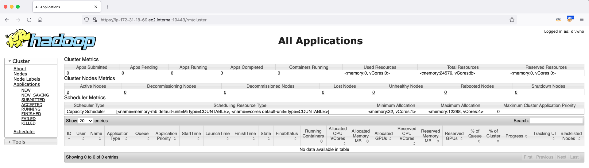

# HTTPS EMR UIs

## Introduction

This package contains a script that will secure YARN, Tez, Spark and Hadoop UIs uxing nginx and the encryption artifacts upload to Amazon S3 when enabling EMR In Transit Encryption: <https://docs.aws.amazon.com/emr/latest/ManagementGuide/emr-data-encryption-options.html#emr-encryption-intransit>


## Installation

1. Ensure the cluster is configured with in-transit encryption enabled as part of EMR Security configs. The script uses the artifacts provided in the s3 bucket. 

2. Add https-emr-ui.sh as an EMR Step during cluster provisioning 

	```
	--steps '[{"Args":["s3://<bucket>/https-emr-ui.sh"],"Type":"CUSTOM_JAR","ActionOnFailure":"CONTINUE","Jar":"s3://us-east-1.elasticmapreduce/libs/script-runner/script-runner.jar","Properties":"","Name":"Custom JAR"}]'
	```

3. Set up an SSH tunnel to the master node using dynamic port forwarding <https://docs.aws.amazon.com/emr/latest/ManagementGuide/emr-ssh-tunnel.html>

4. After cluster is provisioned, access UI's via: 

	```
	https://<emr_master_node>:19443/shs/
	https://<emr_master_node>:19443/jh/
	https://<emr_master_node>:19443/rm/
	https://<emr_master_node>:19443/yts/
	https://<emr_master_node>:19443/tez/
	https://<emr_master_node>:19443/hiveui/
	https://<emr_master_node>:19443/presto/
	https://<emr_master_node>:19443/proxy/application_1626201934269_0003/
	```

	Example: RM UI
	
	


## Appendix


## Limitations

This is a demo script. It can be used in production if you accept the limitations and risks associated with running this in production.
